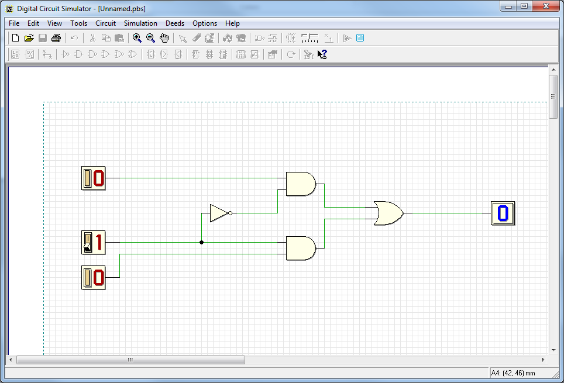
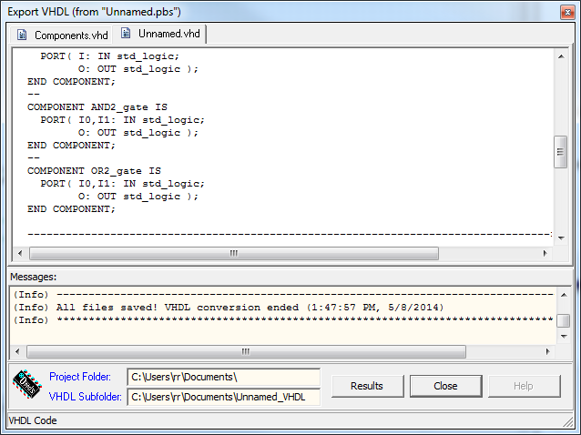

[Download and Install DEEDS](http://www.esng.dibe.unige.it/deeds/ "Digital Simulator").
Also get hold of a [KARNAUGH MAP MINIMIZER](http://k-map.sourceforge.net/ "Free tool for K-Map minimisation").
[Logic Friday](http://sontrak.com/ "I might like Fridays, but I don't like Mondays") is another handy tool.
[Using DEEDS I modeled the Part II a) Circuit (see below) from Altera 1o.1 Labs Digital Lab 1.](ftp://ftp.altera.com/up/pub/Altera_Material/10.1/Laboratory_Exercises/Digital_Logic/DE1/verilog/lab1_Verilog.pdf "We can design and simulate before playing in Quartus II")
This allowed me to simulate the circuit and check out the behaviour.
[caption id="attachment\_1345" align="aligncenter" width="450"] 2-to-1 multiplexer[/caption]
Now if you notice, DEEDs will actually pump out VHDL from the designs, I have to play with this to see if it will talk to our board(s) but who knows.  It should with a little playing.
[caption id="attachment\_1350" align="aligncenter" width="450"] Our design in VHDL![/caption]
