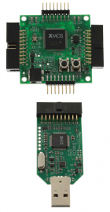
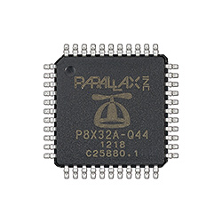

Not a few years ago I was working in on a real-time acoustic system for chasing submarines that introduced me to the Inmos [Transputer](http://en.wikipedia.org/wiki/Transputer "Where did it go?").  Basically it was a hardware based parallel computing platform with a parallel programming language.  It was, ahead of its time.  Parallel programming couldn't really find a niche in those days, no problems big enough.  However, nowadays we have Clusters, Grids, MPI, multi-core and things to do with that power.

The XMOS  comes from the stable that was Inmos and tries to succeed where the transputer failed.  The transputer's clock speed was always woeful and DSP and RISC chips that were coming out soon surpassed them for speed.  Their main strength remained being based upon the [CSP](http://en.wikipedia.org/wiki/Communicating_sequential_processes "Communicating Sequential Processes") model (in hardware) and allowing multiple CPU to be linked together to add the computing power you needed. (One of first table tennis play robots was based on a [transputer system](http://www.researchgate.net/publication/3344657_Ping-pong_player_prototype)).
Now, the upshot.  The XK-1A development board I ordered turned up.  The first thing will be to download a few examples to buzz out the development environment.  The next thing will be to look at porting some of the IMU/AHRS and AutoPilot code.  The chip is a single-core digital device for DSP, interfacing and general processing tasks with:

* Up to 500 MIPS
* Up to 8 threads
* 64KB SRAM
* Up to 64 I/O pins

Remember the Parallax Propeller, the closest comparison in terms of architectural style, is 20 MIPS per cog, or 160 MIPS in total for an 8-cog Propeller.
Note there is a dual an a quad core XMOS chip if the single core isn't enough (1ooo MIPS and 1600 MIPS).

POSTSCRIPT
It occurs to me there is an error in my discussion above. Can anyone see it?
