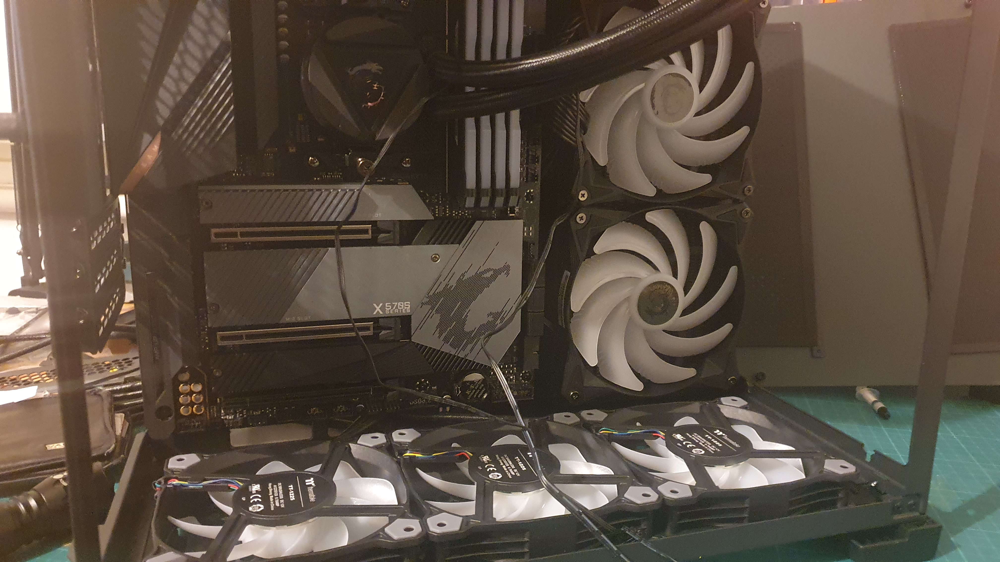
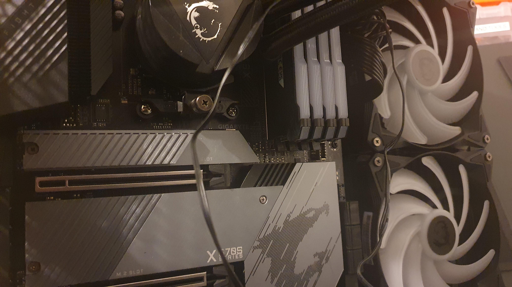
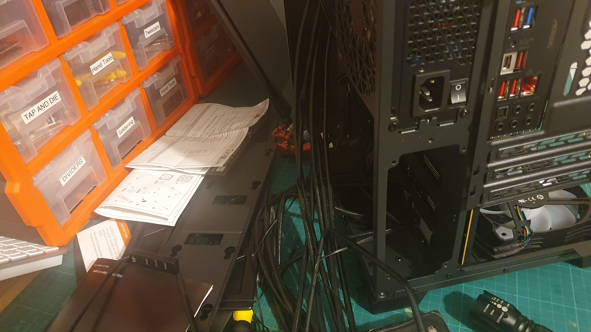

... some progress on the Monsta PC build. Yeah, I got board with the setting up of a build video, as I just want the Monsta built. It wasn't a tutorial in any event, so no shakes giving up on that grand plan.

I seem to be able to hide most of the wiring, except for a dopey wire from the heatsink on the CPU. Which is for the RGB LED for the emblem on the heatsink. Stupid! The must be a trick to that one.

Apart from the RGB wiring off the heatsink, the rest of the wiring for the fans pops through nicely into the hiding space in the back of the unit.

In fact, according to the manual for the Gigabyte X570S AORUS PRO AX AM4 ATX Motherboard - Rev 1.1, the RGB connection can drive up to 1000 addressible LED!

So, some fiddling to get the RGB widgets strung together. The fans come in 3's and with a controller, but the MOBO has means to control the string of addressible RGB LED.

However, the passthrough connection, of the chained RGB connections that the MSI MAG CORELIQUID 280R Liquid CPU Cooler provides, does note mate happily with the connectors on the Thermaltake Pure 12 120mm ARGB TT Premium Fans!

FRAAAAACK!

I have a hankering for another fan, since there is a spot on the back of the case. Problem is, you can't seem to buy a single Thermaltake Pure 12 120mm ARGB TT Premium Fan!

