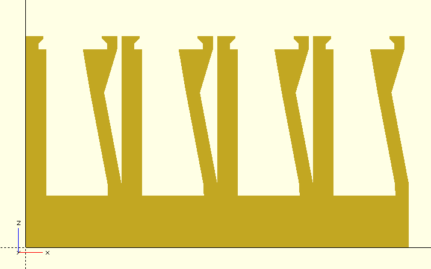
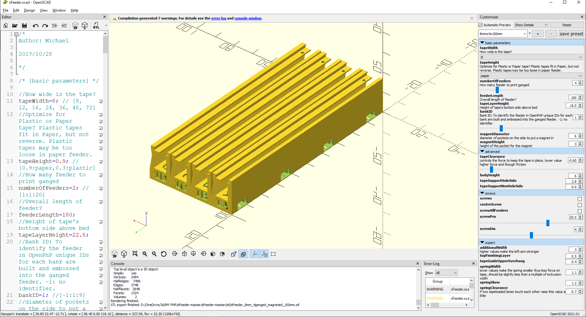
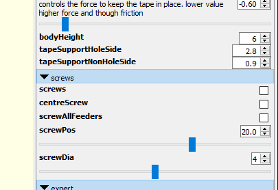
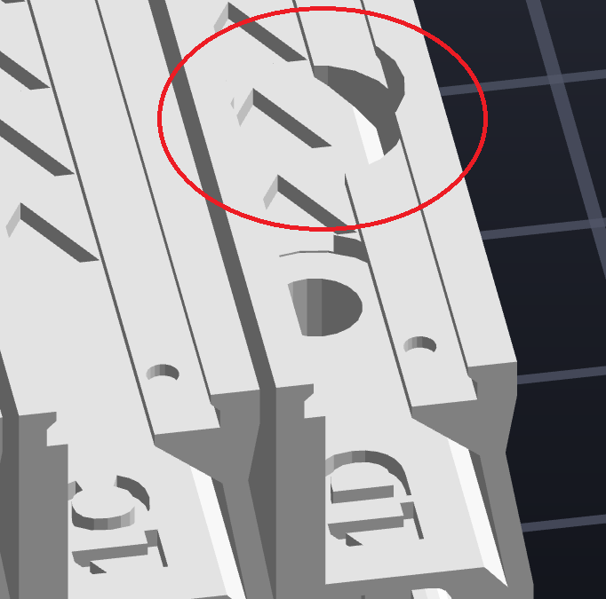
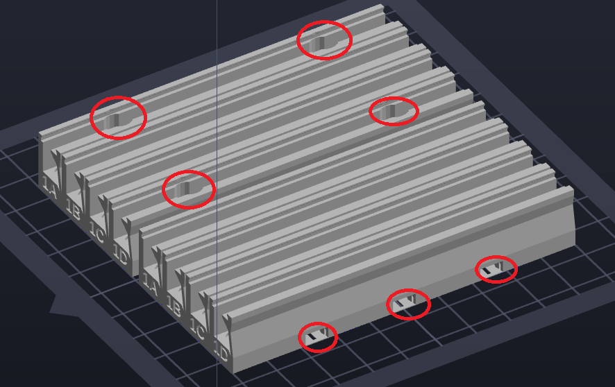
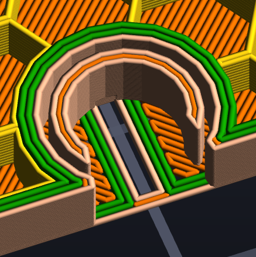
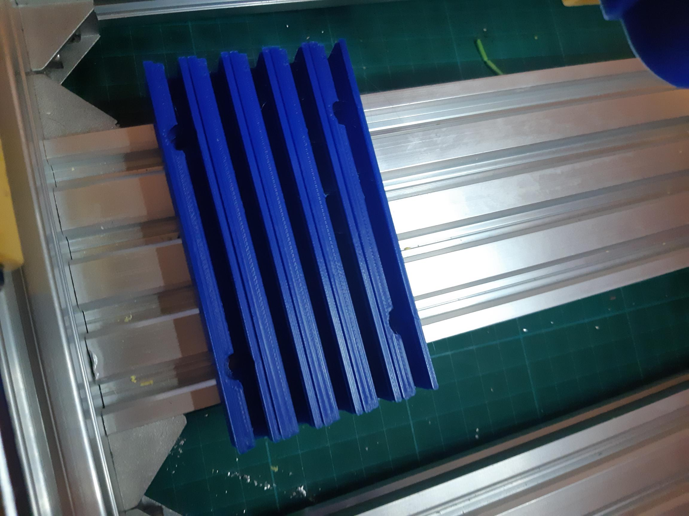

The feeder tray for small strips I am using is [this one](https://www.thingiverse.com/thing:2506053), so thankyou [Michael G](https://www.thingiverse.com/michaelgr/designs).

Results in a SMT feeder tray with the profile in Figure 1.

Figure 1

Its in OpenSCAD and fully tuneable as in Figure 2.

Figure 2

I have tuned the script to fix something that bugged me. The original script included both screws and magnets to hold the tray down. Likely the idea of printing one gadget then choosing mounting means on the day. I opted to either print with screws OR with magnets. I also found the screw option a little over the top, as it put screws into every feeder slot. So I modified the script to optionally only add screws in the end feeders - yes if you are really worried about the tray blowing off in a hurricane, the option to stuff a screw into every feeder is still there. I also uncommented the middle screw code and made it optional - so it will really REALLY stay put in a hurricane AND a tsunami! I also parameterised the screw position from the ends. See the editor modes in Figure 3. You flip between screws and magnetics by toggling the screws option on or off.

Figure 3

In the screw menu you'll notice a screwDia(meter)?! That is now for setting the mounting screws to M3, M4 or M5. I have set the recesses for button heads only, so use hex heads at your peril (just needs ensuring the tape height clears - yes that is a parameter!) I also modified the script to provide access for screws when the tape is set to 8mm, as in Figure 4. I may also play with adding options using countersunk heads, I am fiddling with that now.

Figure 4

So, for your viewing pleasure, an example then of screws in outer feeders OR magnetics is at Figure 5. All of this trouble to allow these trays to be tuned to my [manual PnP machine build](https://www.thingiverse.com/thing:3644398).

Figure 5 - Screws (top tray) or magnets (bottom tray)

But hats off to Michael G for his design for the magnet inserts at Figure 6!

Figure 6

Brilliant! Took me a little while to work this out. What on earth was the inner deposit doing? What is a coding artefact? My first thought was the outer wall was set by the magnet diameter, but ...

... it then dawned on me this was a clever press-fit design, with the inner wall set to the magnet diameter! Clever, since you want a positive purchase but also flex to allow for fitting the magnet. To wit, it provides a very positive and pleasing clicking in the magnet - which requires a little but not excessive force. Keep this idea to the side people, you might find it useful in other designs.

So, this blog's DA VINCI AWARD today goes to Michael G! Congrats!

DA VINCI AWARD FOR CLEVER DESIGN

The end result is in Figure 7. The parameterisation of the holes a must, as I had space for a 100mm tray, with holes 60mm apart, to ride atop the 2080 extrusion beds. I am assuming that I'll get more use out of this arrangement than the push pull feeders as I am buying samples of SMT and not reels at the moment, since I am only making "batches" of up to 5 or 10 boards. The approach being design or use an open source design, get a batch of boards from pcbway, keep one assembled item and sell the rest on ebay (hopefully) to self-fund the projects.

Figure 7
