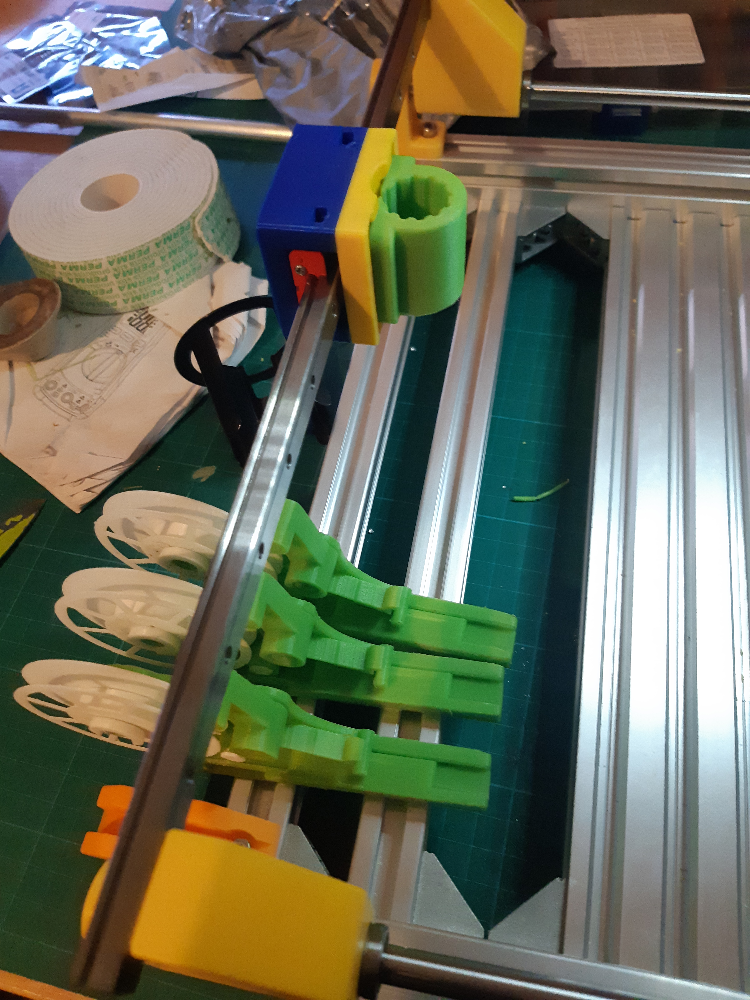

I am working on batches of [pushpull feeders](https://github.com/markmaker/PushPullFeeder) for my manual pick and place machine.

So while waiting on the last few parts to turn up, I have been doing a production run of feeders for the machine, Figure 1.

So a DA VINCI AWARD needs to go to Mark Maker (stage name I assume LOL). Noting I am also using [SMT trays](https://organicmonkeymotion.wordpress.com/2021/11/04/3d-printed-parametric-feeder-tray/) to tuned to fit onto the working beds provided by the 2080 extrusions.

DA VINCI AWARD FOR CLEVER DESIGN
