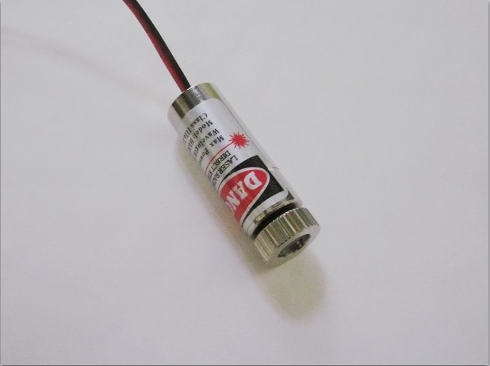

*(\*breathing deeply into a paper bag\*)*
I keep reading blogs, user groups etc where people want to voice "confusion" about laser importing laws in Australia.
The thing about the internet is that, while you will likely have thousands of "opinions" you need only go to the [authoritative source](http://www.customs.gov.au/site/page4372.asp "I have one, so there.") ("Reporting Distance" = 1).
I have a laser "insert inverted commas here" ... oh, I did ... insert inverted commas.
Try again, I have a red line laser module from china, came through customs fine because it is clear on the Australian customs site that laser modules are not restricted - so why bother with blogs and user groups.
The packet will be marked laser and customs will open it but it will turn up.

Something to pair up with the [3D scanner idea](http://organicmonkeymotion.wordpress.com/2013/04/13/3d-scannerlidar/ "3d Scanner/Lidar").
