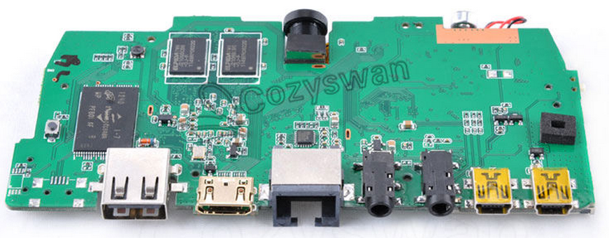
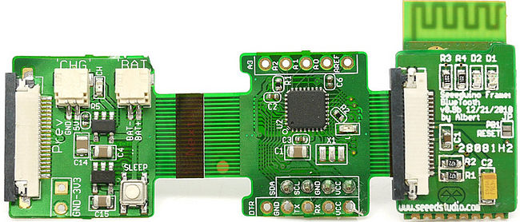
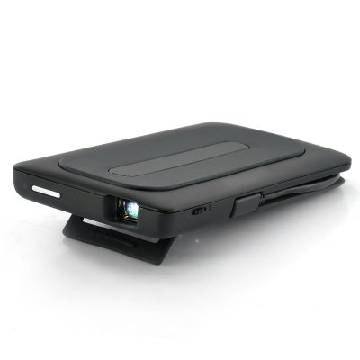

Apart from experiments in wireless location (Bluetooth, Xbee/SNAP and WiFi all provide RSSI values), there is also a likely need for visual odometry.
SLAM, which is a passive sensing approach, is on the cards.  The other is either of two approaches to active visual odometry:

1. [Laser line and webcam](https://code.google.com/p/rp-3d-scanner/ "Uses a laser line to \"cut\" a swath across the visual field").
2. Projector and websam ([structured light](http://desktorch.com/structuredLight/applet/index.html "Softly sketch")).

So, I few experiments on the go (I still have to build my two 64bit dual core AMD boxes to give me some distributed processing grunt) but a webcam with:

|  |  |
| --- | --- |
| **Item** | **Description** |
| **CPU** | **RK3066 Dual Core1.6G (Cortex-A9)** |
| Ram | DDR3 1GB |
| Rom | On board NAND Flash 8G |
| Storage Expansion | SD Card + T-Flash(Maximum support 32GB) |
| Video Format | Support: Max.1920\*1080 MKV(H.264 HP) AVI RM/RMVB FLV WMV9 MP4 |
| Audio Format | Support: MP3/WMA/APE/FLAC/AAC/OGG/AC3/WAV |
| Picture Format | Support: Max.8000x8000 JPEG BMP GIF PNG |
| Web Camera | Support: 0.3M Pixel |
| **Microphone** | **Built-in Microphone** |
| **Headphone** | **Support headphone** |
| WIFI | Support IEEE 802.11 b/g/n |
| LAN | Support 10/100M RJ45 |
| **Bluetooth** | **Support Bluetooth V4.0** |
| Output | 1\*MINI HDMI port(1.4a spec), Maximum support 1920\*1080 60Hz |
| 1\*Video port, Support YPbPr output, Maximum support 1920\*1080 60Hz |
| 1\*Audio port, Support left/right channel output |
| Ports | 1\*standard USB port |
| 1\*MINI HDMI port |
| 1\*RJ45 LAN port |
| 1\*Audio output port |
| 1\*Video output port |
| 1\*MINI USB port, Support OTG |
| 1\*MINI USB port for Power |
| 1\*TF Card slot |
| 1\*SD Card slot |
| Button | **1\*Power button** |
| 1\*Physical button(For upgrading software) |
| LED | 1\*LED power indicator |

; is a start.

This sub $100 device has WiFi, Bluetooth and 10/100 Ethernet built in.  I have ordered two so one can be paired with a laser and one with a miniature led projector (for the structured light work).  Either can be used for monocular SLAM etc.  Paired they could be used for STEREO slam.
I will set up a Seeduino Film as a Laser Driver:

I suspect the various outputs of the webcam (HDMI, AV, USB etc) will allow me to drive a LED projector for the structured light:

