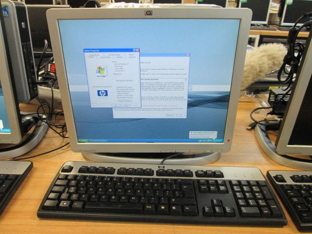

Got a deal through an auction site and got myself a box to be my 64bit linux server (for some of the 64-bit python toys).
Just a 3Ghz Core Duo HP box.  Comes with nifty monitor that has case attached and monitor can slide up and down.

I just need a video switch so I can pair this with my [32bit Atom/Linux box](http://organicmonkeymotion.wordpress.com/2013/01/01/xmas-holidaze-bad-ubuntu/ "Xmas holidaze – bad Ubuntu").

#### 
