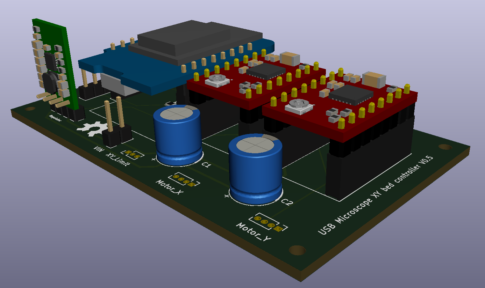
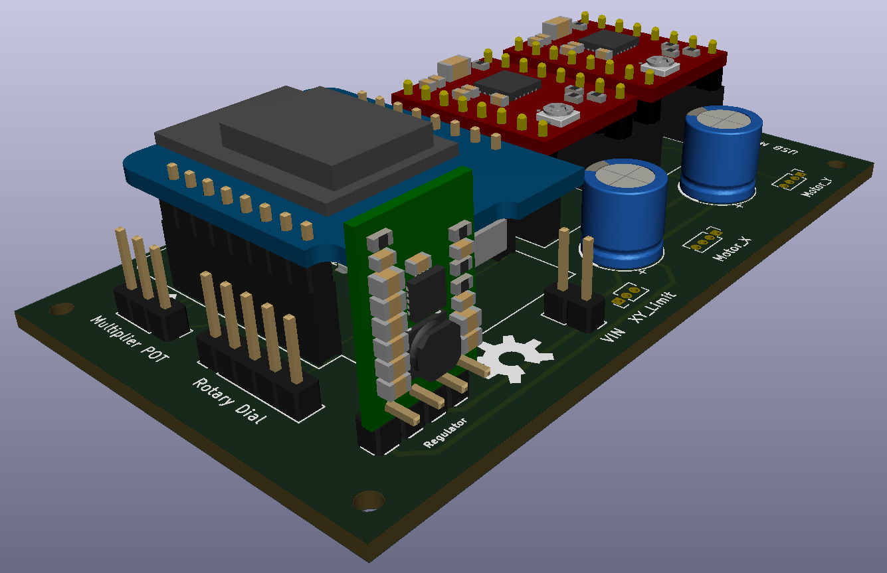
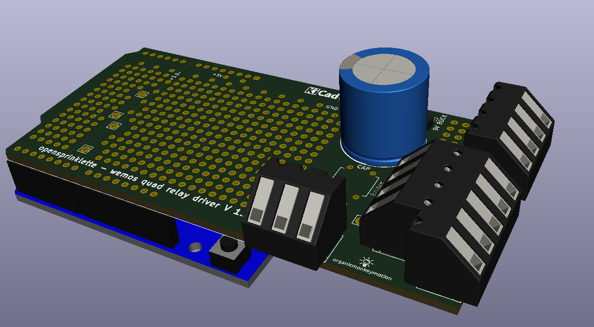
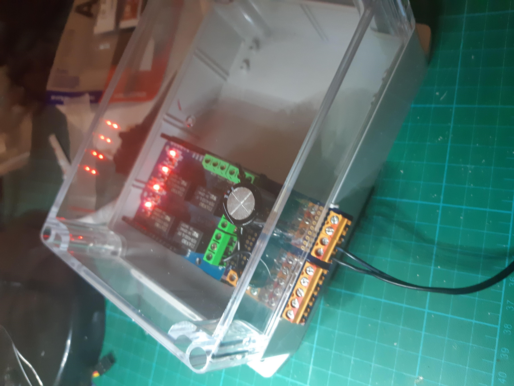

This 3D stuff in KiCAD is fantastic. Found a Wemos D1 R2 model and played with modelling up the opensprinklette V1.2 board thus:

Needs some work. Have to re-design the Wemos D1 R2 model I found, since it doesn't appear KiCAD ready. The sockets are wrong positions. I also want to find terminal blocks closer to what I am actually using. Then there is the other bits, including the quad relay board. Will be a fun exercise to learn how to build 3D models for KiCAD I think.

