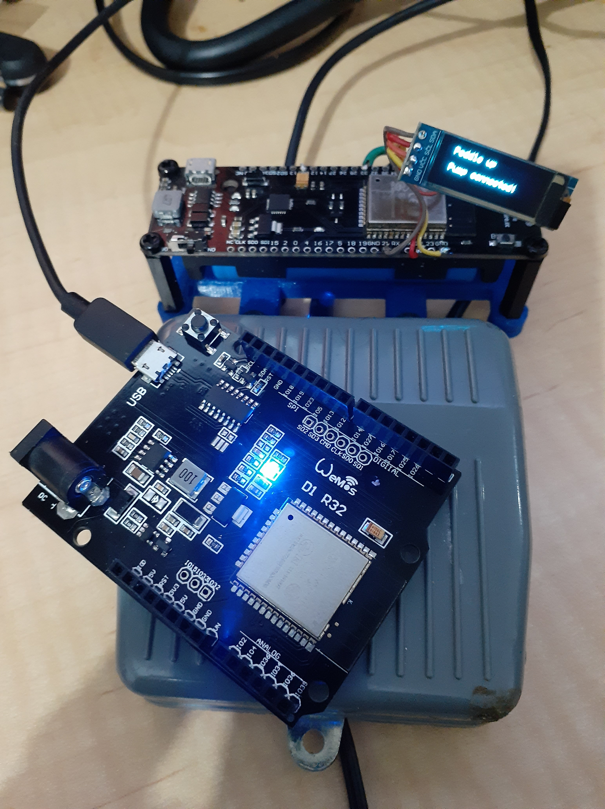

I have tried, unsuccessfully, to get a MQTT broker running on the ESP32, despite some offerings (too many still in work). I did then find articles on ESP-NOW, which is a peer2pear setup over WiFi. Hence, I opted to rewrite my PnP pneumatic setup as ESP-NOW.


The setup will comprise an Wemos BT with battery (wemosbat under PlatformIO devices) as a WiFi foot pedal and AP, with a quad relay shield sitting on a Wemos D1 R32. The D1 R32 will control a pneumatic solenoid and a pump. You want to get the pump spun up BEFORE you upon up the pneumatic solenoid, and close the solenoid BEFORE you shut down the pump.


[](./duo.jpg)


Currently, the "pump" needs to be turned on before the "pedal". I still need to investigate how ESP-NOW handles loss of connections/reconnections.


PEDAL


The pedal has a SSD1306 132x32 pixel display to let you know when the two devices are connected, and also the state of the pedal press.


```
void setup() { // of ESP-NOW "master" and an ESP32 AP to boot
  Serial.begin(115200);
  // SSD1306_SWITCHCAPVCC = generate display voltage from 3.3V internally
  if(!display.begin(SSD1306_SWITCHCAPVCC, SCREEN_ADDRESS)) {
    Serial.println(F("SSD1306 allocation failed"));
    return;
  }
  
  // setup access point
  WiFi.mode(WIFI_AP_STA);
  WiFi.disconnect();
  
  delay(1500);
  WiFi.softAPConfig(local_ip, gateway, subnet);
  WiFi.softAP(ssid, password /* , channel, hide_SSID, max_connection*/);
  delay(1500);
  Serial.print("\nMAC: ");
  Serial.println(WiFi.macAddress());
  // start ESP-NOW
  InitESPNow();
  registerCallback();
  // setup pedal input
  bounce.attach( BOUNCE_PIN ,  INPUT );
  bounce.interval(5); // interval in ms
  displayUpdate(bounce.read(),pumpPresence);
  // LED SETUP
  int ledState = HIGH;
  pinMode(LED_PIN, OUTPUT);
  digitalWrite(LED_PIN, ledState);
  // add peer
  registerPeer();
}
```


The trick to get the two to talk together, as AP/STA pair, was the following code on the AP device.


```
 WiFi.mode(WIFI_AP_STA);
 WiFi.disconnect();
```


I had found the trick with the `WiFi.disconnect()` associated with an `STA` based "master". The code does not talk to the "peer" unless the "master" has `STA` (apparently). Blowed if I know why you need the `WiFi.disconnect()`?! As usual, it turns up in a hack someone has done, but the "why" is not included. I had started with:


```
 WiFi.mode(WIFI_AP);
```


Throughout, `pumpAddress` is your usual (example only):


```
uint8_t pumpAddress[] = {0x84, 0xCC, 0xA8, 0x2C, 0x0D, 0xA8};
```


PUMP


So, the pump doesn't need any real tricks. Just connect to the AP and then init ESP-NOW and add your OnReceive callback.


```
void setup() { // of "slave" peer, will be on wifi setup by ESP32 AP
  Serial.begin(115200);
  
  // setup access point
  WiFi.mode(WIFI_STA);
  if (!WiFi.config(local_IP, gateway, subnet)) {
    Serial.println("STA Failed to configure");
  } else {
    Serial.print("STA configure as local IP: ");
    Serial.print(local_IP);
    Serial.print(" gateway: ");
    Serial.print(gateway);
    Serial.print(" subnset: ");
    Serial.println(subnet);
  }
  
  WiFi.begin(ssid, password);
  while(WiFi.status() != WL_CONNECTED){
    Serial.print(".");
    delay(100);
  }   
  Serial.print("\nMAC: ");
  Serial.println(WiFi.macAddress());
  // start ESP-NOW
  InitESPNow();
  esp_now_register_recv_cb(OnDataRecv);
  pinMode(LED_PIN, OUTPUT);
  digitalWrite(LED_PIN, LED_OFF);
}
```


HELPERS


For this application, the `registerPeer()` function only needs to add a single "peer" in this app. But there is a raft of other "peer" related functions that may need investigation, since the simplest setups appear not to allow for a re-connect of peer (if it goes down then comes up again).


```
void registerPeer (void) { 
  memcpy(peerInfo.peer_addr, pumpAddress, 6);
  peerInfo.channel = 0;  
  peerInfo.encrypt = false;
  esp_err_t status = esp_now_add_peer(&peerInfo);
  switch (status)
    {
    case ESP_OK:
      Serial.println("Peer registered");
      break;
    case ESP_ERR_ESPNOW_NOT_INIT:
      Serial.println("ESP NOW not actually initiated");
      break;
    case ESP_ERR_ESPNOW_ARG:
      Serial.println("ESP NOW error in argument");
      break;
    case ESP_ERR_ESPNOW_FULL:
      Serial.println("ESP NOW peer list is full");
      break;
    case ESP_ERR_ESPNOW_NO_MEM:
      Serial.println("ESP NOW no memory");
      break;
    case ESP_ERR_ESPNOW_EXIST:
      Serial.println("ESP NOW peer has existed");
      break;   
    default:
      Serial.println("Unknown error peer registration");
      break;
    }
}
```


For the AP, I opted for full debug on status return of the pedal message send in `pedalPressed()`. This actually help understand why, in my first attempts, the "master" and "slave" were not talking. This was despite the "slave" appearing to find and connect to the AP.


I thought, originally, that the "master" and "slave" were not talking because I was never getting a callback function trigger. At first, I thought that was an error in callback registration. The debugging messages of the call back register function (see next function) were, however, always happy.


It turned out the problem was I needed the change from `AP` to `AP_STA`. The error I started getting back, when I used `pedalPressed()`, was "ESP NOW peer wifi mismatch" (aka `ESP_ERR_ESPNOW_IF`).


```
void pedalPressed (void) {
  pumpMessage.pumpFlag_msg = PEDAL_PRESSED;
  esp_err_t status = esp_now_send(pumpAddress, (uint8_t *) &pumpMessage, sizeof(pumpMessage));
  pumpPresence = PUMP_UNAVAILABLE;
  switch (status)
  {
  case ESP_OK:
    Serial.println("Pedal press sent");
    pumpPresence = PUMP_PRESENT;
    break;
  case ESP_ERR_ESPNOW_NOT_INIT:
    Serial.println("ESP NOW not actually initiated");
    break;
  case ESP_ERR_ESPNOW_ARG:
    Serial.println("ESP NOW error in argument");
    break;
  case ESP_ERR_ESPNOW_INTERNAL:
    Serial.println("ESP NOW internal error");
    break;
  case ESP_ERR_ESPNOW_NO_MEM:
    Serial.println("ESP NOW no memory");
    break;
  case ESP_ERR_ESPNOW_NOT_FOUND:
    Serial.println("ESP NOW peer not found");
    break;   
  case ESP_ERR_ESPNOW_IF:
    Serial.println("ESP NOW peer wifi mismatch");
    break; 
  default:
    Serial.println("Unknown error in send");
    break;
  }
}
```


The function `registerCallback` is mostly to keep the code clean.


```
void registerCallback (void) {
  esp_err_t cbstatus = esp_now_register_send_cb(OnDataSent);
  switch (cbstatus)
  {
  case ESP_OK:
    Serial.println("cb registered");
    break;
  case ESP_ERR_ESPNOW_NOT_INIT:
    Serial.println("ESP NOW not actually initiated");
    break;
  case ESP_ERR_ESPNOW_INTERNAL:
    Serial.println("ESP NOW internal error");
    break;
  default:
    Serial.println("Unknown error in cb registration");
    break;
  }
}
```


So to the function `InitESPNow()`.


```
void InitESPNow(void) {
  //If the initialization was successful
  if (esp_now_init() == ESP_OK) {
    Serial.println("ESPNow Init Success");
  }
  //If there was an error
  else {
    Serial.println("ESPNow Init Failed");
    ESP.restart();
  }
}
```


https://youtu.be/\_m1GAsmXG2U


https://youtu.be/\_hRNeletC0w


Therefore, there may be more to setting up ESP-NOW, that requires a little work to find the real *destructions*.
