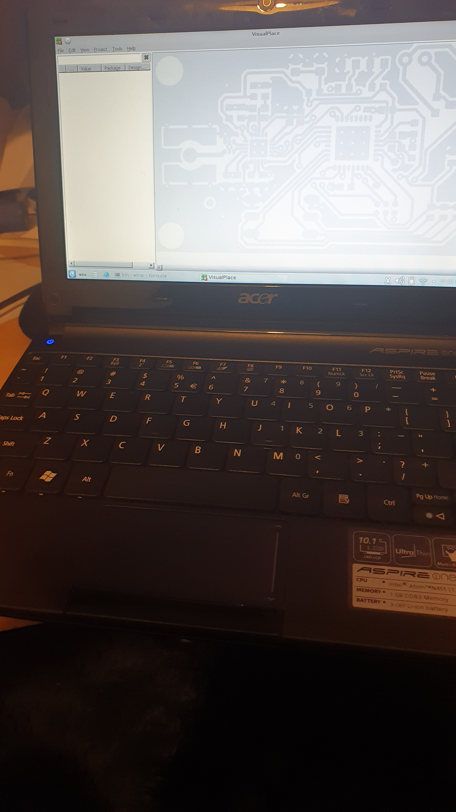
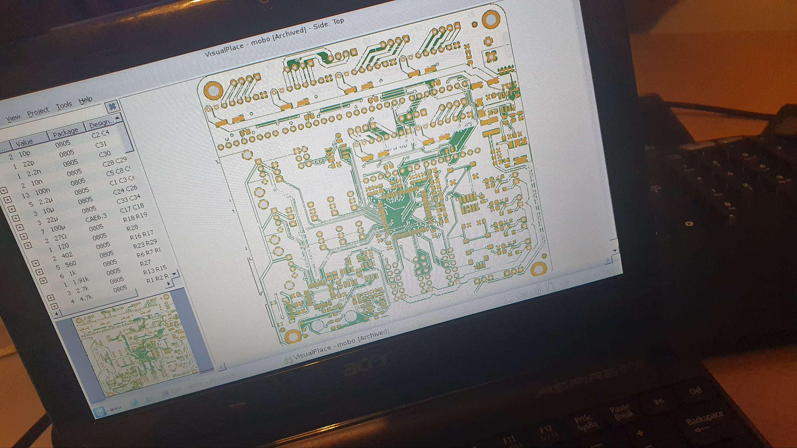

So, me Acer Aspire One, with USB camera, needed a little more tool support for manual PnP ops.

I had to poke around with the app installer, to learn about setting up to find [the new place for Jesse archives](http://archive.debian.org/debian/dists/jessie/main/). This was because the default vault pointed to, in the original install of Jesse, was the now the long deprecated vault.

Once that was set up, I was able to install [WINE](https://wiki.debian.org/Wine).

With [VisualPlace](https://www.compuphase.com/visualplace/visualplace_en.htm) unzipped into a folder, I started VisualPlace with WINE, was prompted to let WINE install DOT NET, a little more whirling and VisualPlace opened up!

Here's the [LumenPnP](https://github.com/opulo-inc/lumenpnp) [mobo](https://github.com/opulo-inc/lumenpnp/tree/main/pnp/pcb/mobo) by [Opulo](https://opulo.io/products/lumenpnp), on me Acer Aspire One! This mobo would be way more complicated than I might bother with on my smaller manual PnP, but might be just the ticket for my larger manual PnP. So, a good test. It didn't seem to choke the 1.66GHz Intel Atom, purring inside the Aspire One.

The thing, though. VisualPlace uses IP cameras, not USB. I am stuck with Jessie 8, since that is the last 32bit linux, and since the Acer Aspire is running an Atom.

So, poking around, software on Linux of that vintage, to stream a USB camera, seems to come down to [mjpg-streamer](https://github.com/jacksonliam/mjpg-streamer). The idea that the laptop can stream to localhost port and VisualPlace can pick up the local USB camera that way.

Seems to hinge, therefore, on dependencies like libjpg8-dev. Which appears problematic currently, with apt store archive reporting "no comprende". Alternates, including libjpg62-turbo-dev bring up a knotted web of dependencies and, therefore, the threat of junk imports, especially if after going that way, it still does not work etc.

However, with a little poking around, found a snapshot archive for [libjpg8-dev](http://snapshot.debian.org/archive/debian/20141009T042436Z/pool/main/libj/libjpeg8/). Had to grab both [libjpg8\_8b-1\_i386.deb](http://snapshot.debian.org/archive/debian/20141009T042436Z/pool/main/libj/libjpeg8/libjpeg8_8b-1_i386.deb) and [libjpg8-dev\_8b-1\_i386.deb](http://snapshot.debian.org/archive/debian/20141009T042436Z/pool/main/libj/libjpeg8/libjpeg8-dev_8b-1_i386.deb).

I have put a pitch to the author of VisualPlace anyway for, maybe, a USB camera option.

Meanwhile, I have to get emotionally prepared to have to do that thing. You know that thing of which I speak. The thing being the need to work through installing a poorly documented piece of "free" software, and \*cringe\* maybe having to approach user "help" groups, to then have to duck around the chaff offered by well-meaning people, who have no other life, and otherwise offer no "help".
