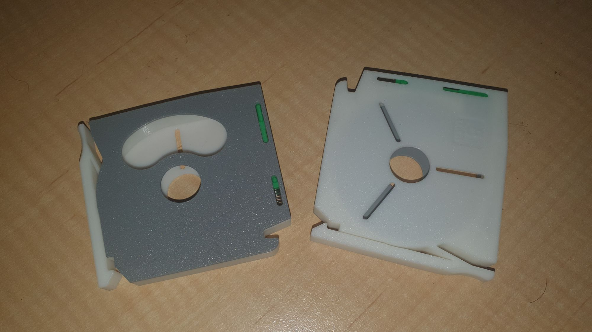
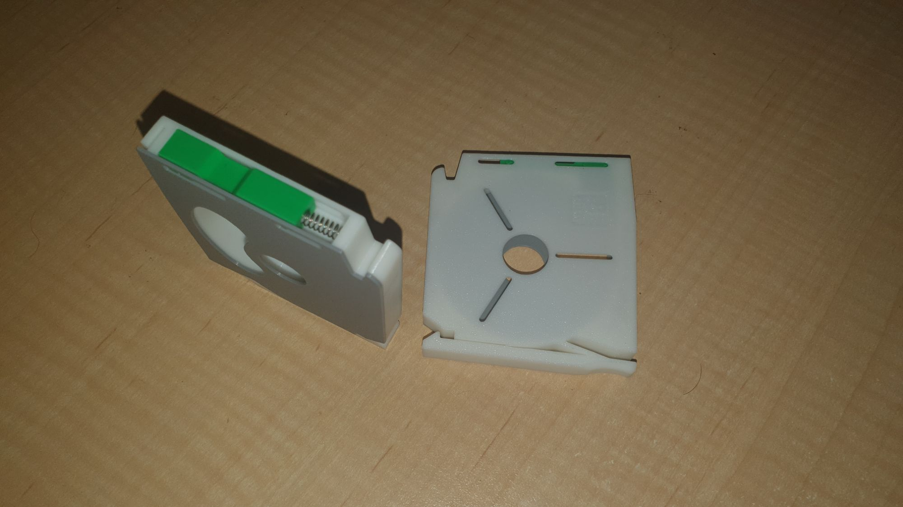
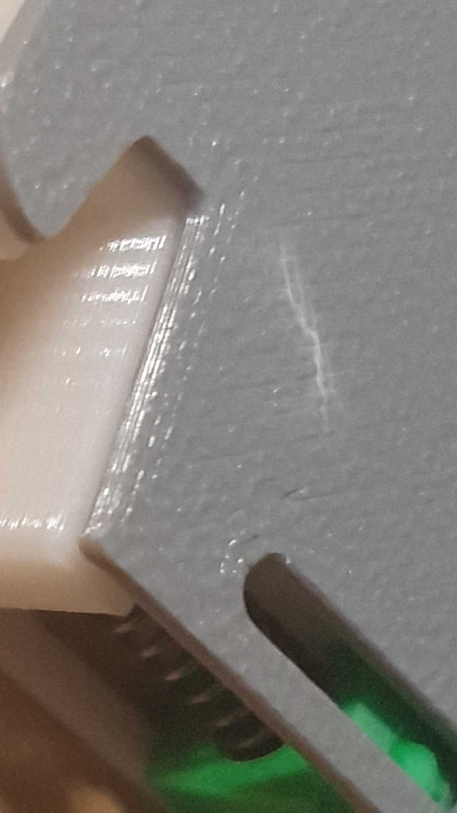
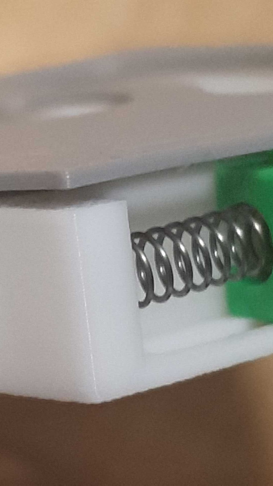
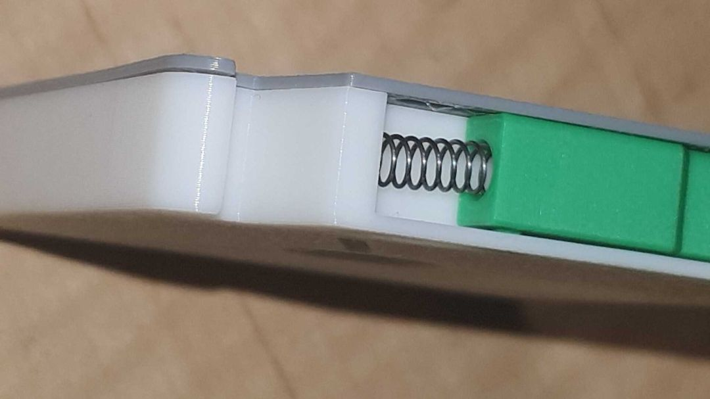

SMD tape dispensors from [here](https://www.printables.com/model/580643-smd-component-tape-magazine-8-12-16mm).

Very tidy and kool design. Needs a biro pen spring from aliexpress but the action on the door devine!

There are quirks with assembly however. Notice the stressed plastic in shot below. It was due to the last set of prongs not being happy with their alignment.

It also leaves a gap, which seems to be because something gets jammed up in the process of forcing the thing in (given it's so out of wack). I've tried some forces short of breaking the thang but it looks well jammed.

However, when I thought it over, the way to approach this was to press those prongs in first and not last an voila!

So I'll need pull the test piece apart and print another cover, but otherwise way kool!

I'm putting 30 together in the 8mm variant as there's about 18 standard resistors and probably 12 for capacitors, and these are great for the 100 piece samples of 0805s for manual builds in combination with the rotundra sorter.

