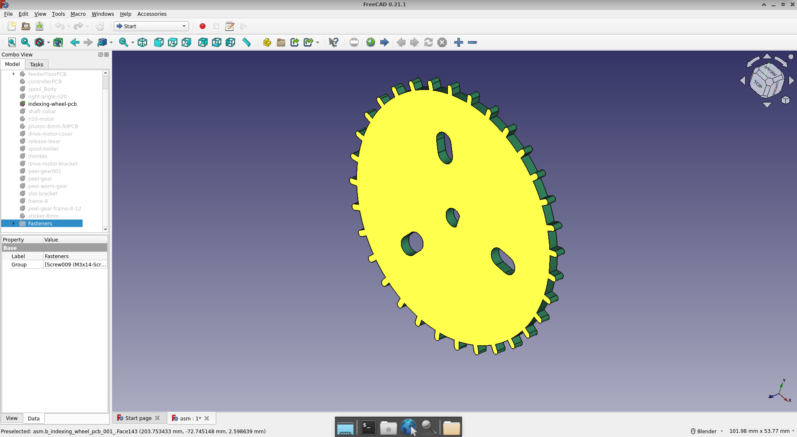
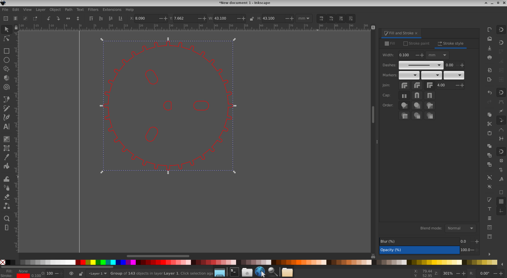
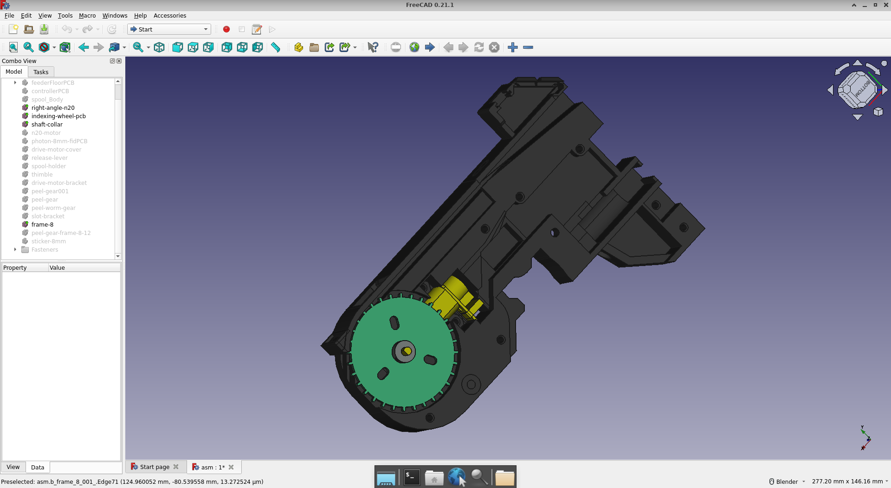

I bought me some [RS PRO Brown Plastic Shee](https://au.rs-online.com/web/p/plastic-sheets/2035346?bid=42706020&cid=rscDM728&cm_mmc=AU-EM-_-undefined_07%2Fan%2FSun%20-_-rscDM728-_-Product_Description_Link&dtm_em=db201b2bb42154204d6d3bb87d3f1469a544e957b2571232c93c98758d0e819b)t.

Why you may ask?

To convert this in FreeCAD:

To this in InkScape:

And thence onto a "laser" cutter.

Being part of this:

Hopefully, the 3D print of this is sitting on the large bed printer at the makerspace for me to pick up later this week.

In case you can't picture it:

Or, find the [dxf file for same](https://github.com/opulo-inc/feeder/blob/main/pcb/indexingWheel/indexingWheel-outline-rev05.dxf).
