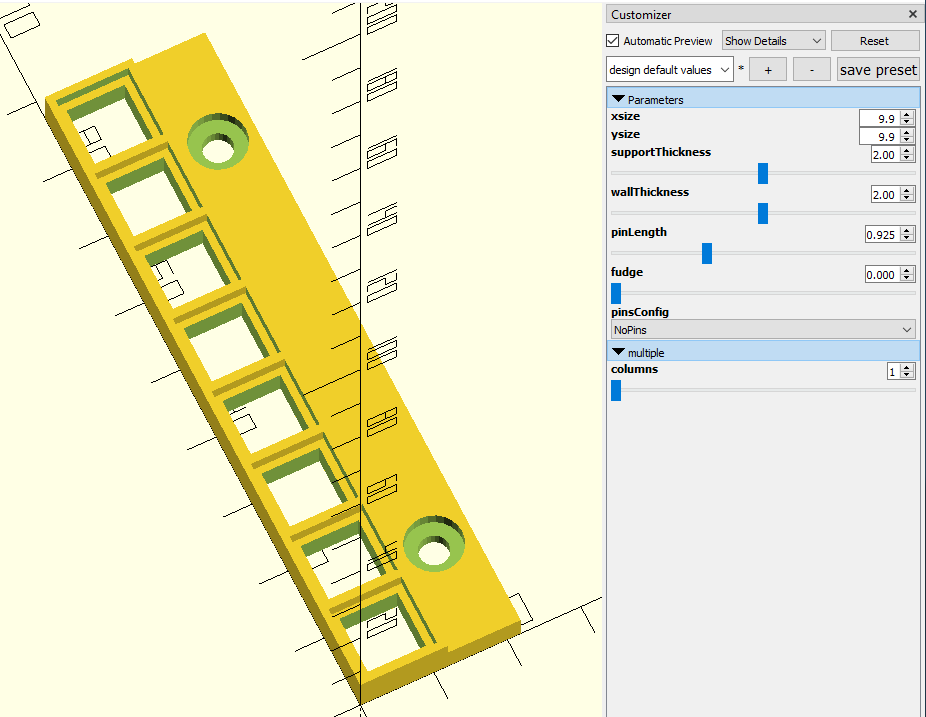
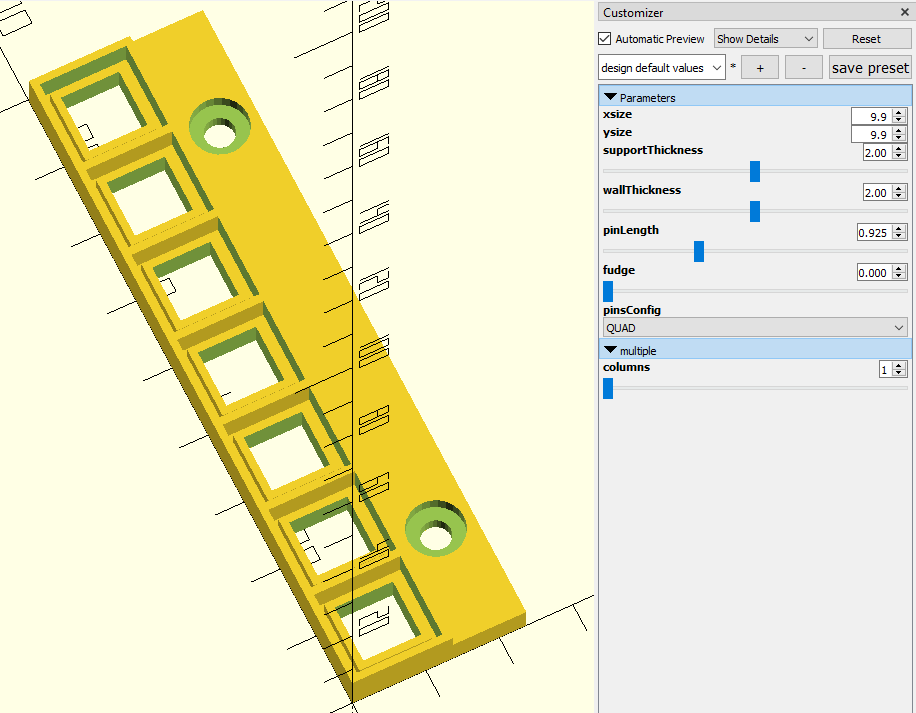
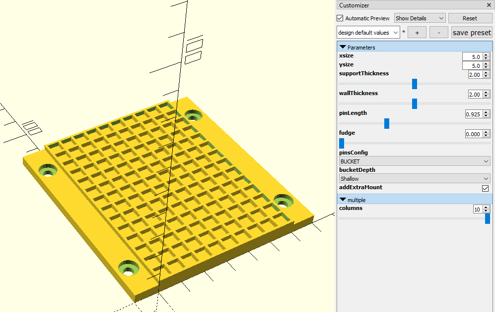
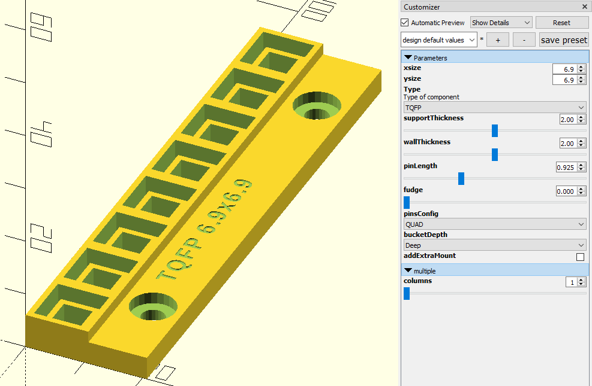
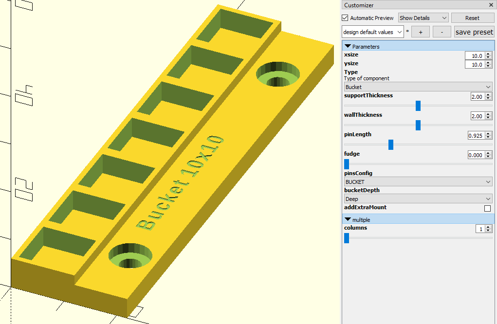
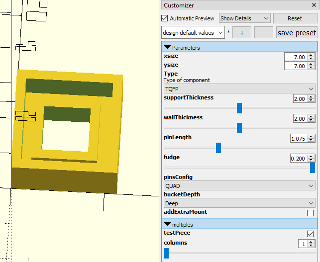
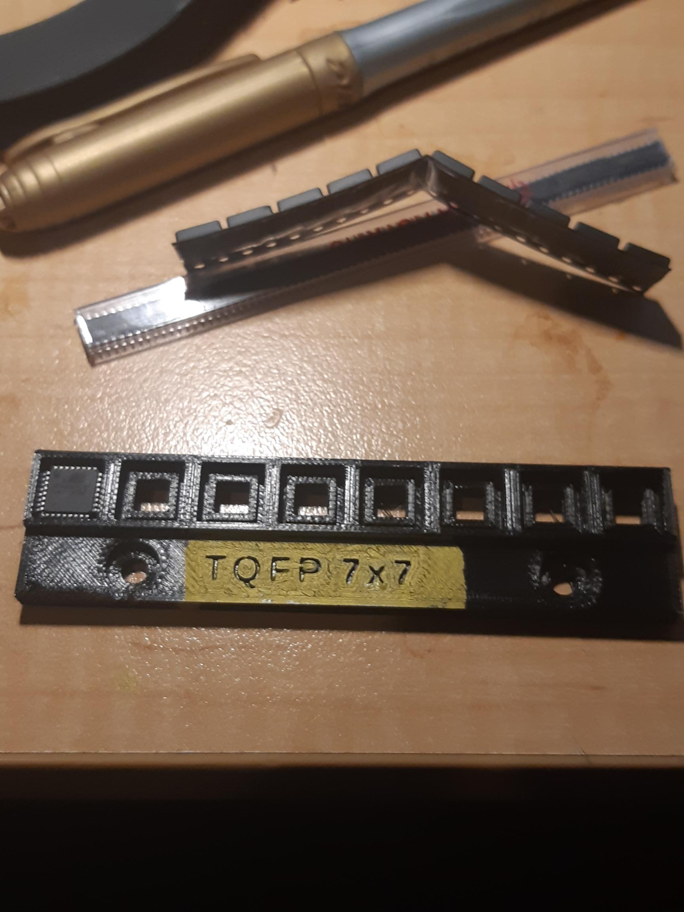

No Pins (just a package)

Dual Inline Packages

QUAD (pins all the way around)

The way I do this is set the length to 80mm (of the 2080 variety), divide by pocket Y dimension and use the ceiling to get the actual row count (so the width may be slightly wider than 80mm but by a proportion of a single pocket). I then centre the bisector of the screw holes so they are always centred on whatever the length becomes and they are also always 60mm apart to mount in the outer slots of the 2080 extrusion on the bed of the manual PnP.

Scheisser!

I need also define a bucket! Give me a moment ... okay. So, I made buckets Shallow or Deep and I also added an option to add a mount at the other end.

BUCKET

What? The atmega328p has a 6.9mm package? Say what? You want WHAT? Embossed labelling?! You are one HARD audience!

Mitt embossed label

And before you ask

Blah, blah, blah, blah, blah, ... so I also then added a test piece build.

Test piece generation to do quick print checks of bucket sizes

Happy little vegemite, snug as a bug!
