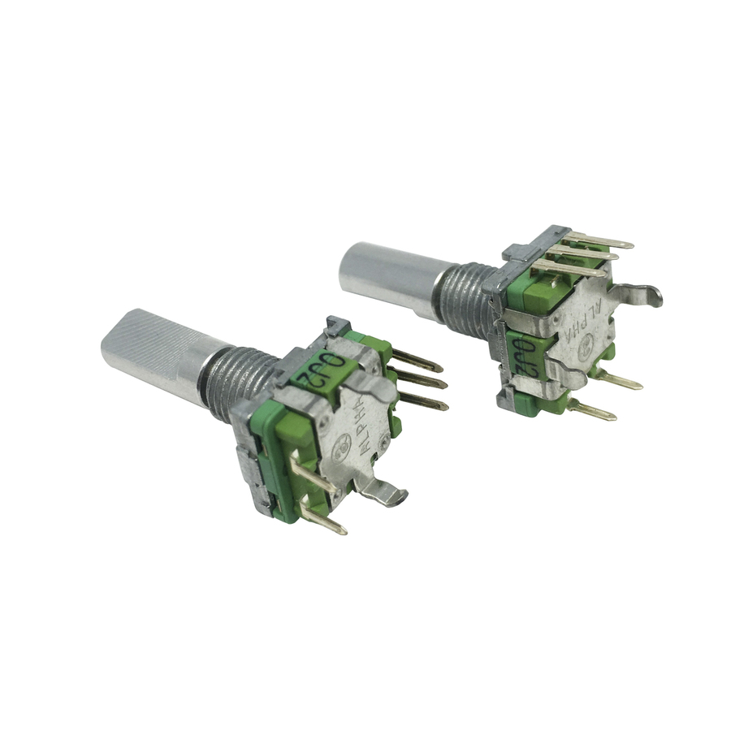
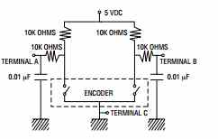
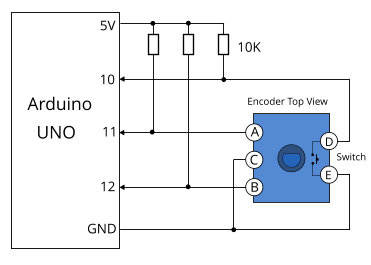
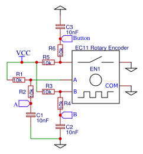
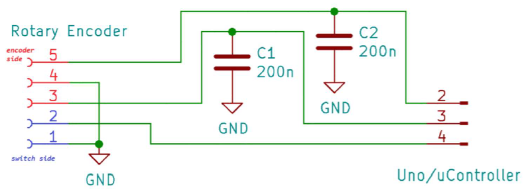

Yep I did talk about rotary encoders and I suppose the image with a breakout of an encoder would suggest I had bought the following:

Figure 1

... but I did actually buy the [raw SR1230 encoder from Jaycar](https://www.jaycar.com.au/rotary-encoder-with-pushbutton/p/SR1230?pos=1&queryId=c65ecd475defd0d213d9510c9189afa4#accessibletabscontent0-2):

Figure 2

So onto the problem of switch bounce and thence onto debouncing via various trickery (for a PEC11L):

Figure 3

But let's [not forget](https://www.robotics.org.za/EC11-VS-15):

Figure 4

Which contradicts Figure 3, though [Figure 5](https://easyeda.com/modules/Rotary-Encoder-EC11_12e1acec849e4cf996d4bc527902a83f) is close to Figure 3:

Figure 5

Or just (for a SR1230 from Jaycar):

Figure 6

Not forgetting [to mention](https://arduino.stackexchange.com/questions/16365/reading-from-a-ky-040-rotary-encoder-with-digispark), and probably tricks in the software:

Figure 7

Of course the Jaycar site provides Figure 6 which does not help decode the pins on the rotary encoder as they provide the datasheet for the encoder and the manual for the version that is on a breakout, so there is no correlation really of encoder pins to breakout pins without poking around with a voltmeter. Figure 7 potentially helps here to sort that out. Probably, to relate this to the pins on the left of Figure 7, if you start bottom right pin Figure and count counter-clockwise it's: 1=GND, 2=SW, 3=A/CLK, 4=C/GND, 5=B/DT.

My reading has got me this far, is the recommendation to have 10K pull up resistors on the encoder A/B (aka CLK/DT) lines and maybe the switch also. So, unless problems arise, I will need use pullups in the CKT, DT and SW pins - which should start out as the trusty INPUT\_PULLUP option when setting the pins up.

I will start with the 200nF caps, thought the confusion is the info on the encoder breakout Jaycar sells, which mounts the same SR1230 encoder, only suggests 100nF caps.

I am assuming the difference between 0.01uF of Figure 3 and 100pf - 200pf of the Figure 4 is the manufacturer and therefore encoder is different. Although there are also a raft of examples on the Net that don't use additional resistors or caps, so generally not very useful.

Might be in luck with the code: <https://github.com/LennartHennigs/ESPRotary>

Which in principle appears based upon (going by my research): <https://github.com/PaulStoffregen/Encoder>

For a good discussion and animation of the problem see "[Last Minute Engineers](https://lastminuteengineers.com/rotary-encoder-arduino-tutorial/)". Noting also they've also got a mapping of DT=B and CLK=A (as per Figure 5). So I think we are good there.

https://lastminuteengineers.com/wp-content/uploads/arduino/rotary-encoder-working-animation.gif
