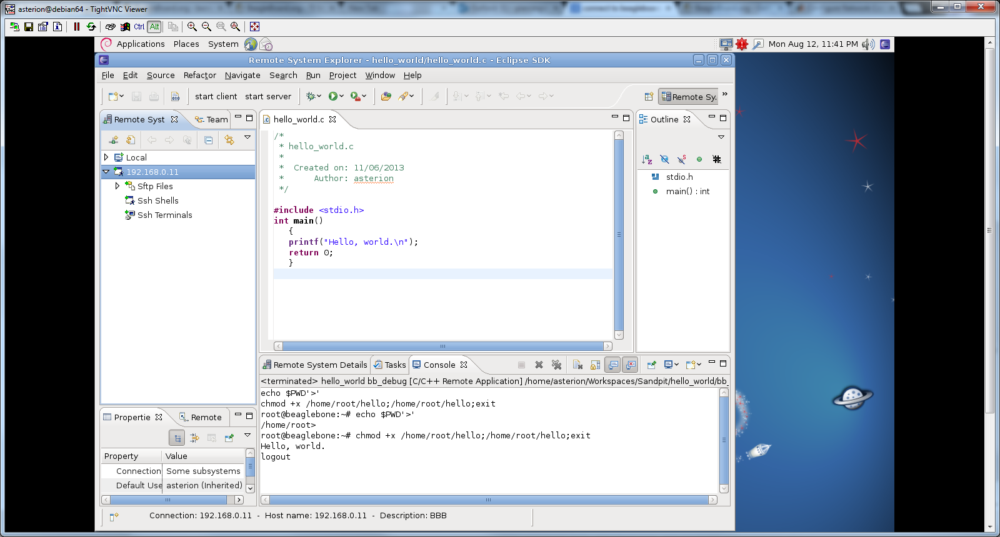

... it turned out to be a couple of hours as I found I could connect to the B[BB from Winoze box but not from the 64 bit Debian box](http://organicmonkeymotion.wordpress.com/2013/06/15/beaglebone-black-setup/ "Beaglebone Black Setup")??
Turned out the BBB, like the BB, is a little dodgy and needs to be reset as you are not guaranteed an Ethernet connection on startup.
Makes it a nuisance I imagine for embedded applications I am guessing.
In any event, finally got around to doing hello world from Eclipse.

Just a start.  [Now the fun begins](http://organicmonkeymotion.wordpress.com/2013/06/11/head-of-steam/ "Head of steam …").
