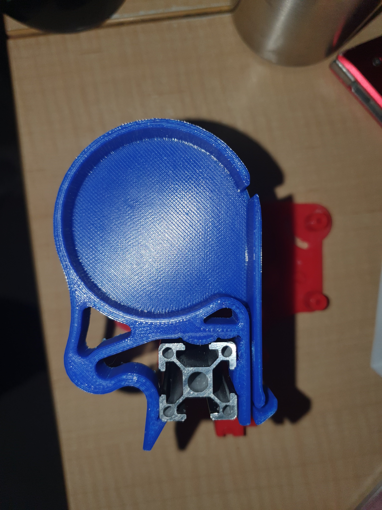
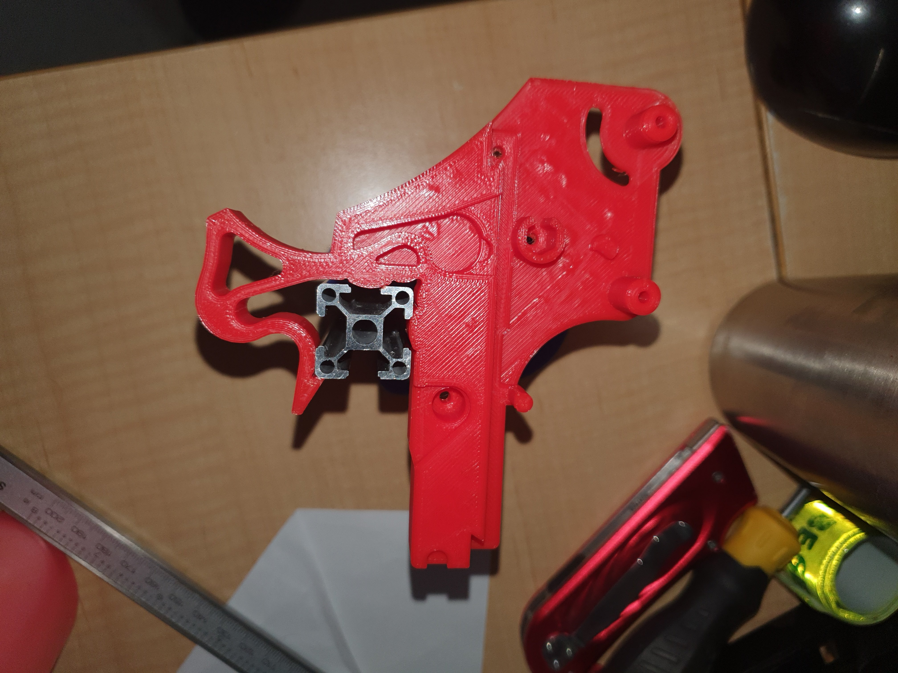
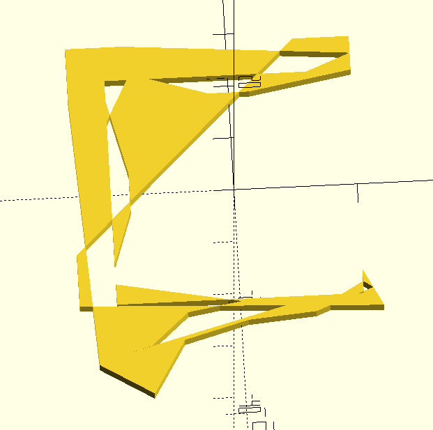
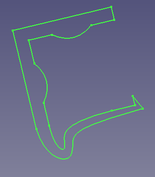

... or, when using a raft of mesh based tools.


Found a really clever design for a small smt reel.





Notice the compliant mechanism to hold itself on the rails. (Side bar: it appears designed for V and not T slot)


Now you KNOW I like the following smt feeder.


But what if they did the "nasty", or call it "the beast with two backs" ... sure there would be  dinner and drinks and soft candle light beforehand. You'd would get something like this ...





... right!?


I note that the pushpullfeeder mesh was not happy about being "refined" in Freecad, and needed some work in MeshLab first. After sorting out the pushpullfeeder mesh, and so both meshes were refineable, I was able the slide and dice and splice to get a prototype.


But, interesting right!


WITH BOTH FISTS FULL OF BANANAS!


I am now playing with OpenSCAD, beziers, and mockups of 2020 extrusions to see about designing up a mod for the pushpullfeeder SCAD code to add this style of clip as an option.


UPDATE


So the beziers is to do with how to craft the curves right?! Multiple sources of bezier code for OpenSCAD. But I did think also there is an OpenSCAD export option from FreeCAD right?! Why the fuss with OpenSCAD? Well the pushpullfeeder design is in OpenSCAD, so the idea is add an option in that for the compliant clip by having a hard coded shape from the FreeCAD export into OpenSCAD code.


Odd thing though, if you create a sketch and extrude it, the shape exports as the NULL empty thang:


group() {  
group(){  
}  
}


If you just export just the sketch you get:


group() {  
group(){  
polyhedron ( points = [[4.579000,9.999559,0.000000],[-4.579000,9.999559,0.000000],[-9.987123,9.999559,0.000000],[-9.987123,4.579000,0.000000],[-9.987123,-4.579000,0.000000],[-9.987123,-9.999559,0.000000],[4.588173,-9.997457,0.000000],[10.017923,-9.997457,0.000000],[10.017923,-7.854818,0.000000],[11.622146,-11.140176,0.000000],[-13.012877,-10.000441,0.000000],[-13.012877,12.999559,0.000000],[9.987123,12.999559,0.000000],[9.987123,9.999559,0.000000],[1.645457,8.462587,0.000000],[-1.645457,8.462587,0.000000],[-6.381708,9.999559,0.000000],[-8.184416,9.999559,0.000000],[-9.987123,6.385853,0.000000],[-9.987123,8.192706,0.000000],[-8.450152,1.645457,0.000000],[-8.450152,-1.645457,0.000000],[-9.987123,-6.385853,0.000000],[-9.987123,-8.192706,0.000000],[0.119568,-10.201215,0.000000],[-4.281091,-10.972281,0.000000],[-7.369510,-13.823068,0.000000],[-9.386519,-14.410621,0.000000],[6.398090,-9.997457,0.000000],[8.208007,-9.997457,0.000000],[10.017923,-8.926138,0.000000],[10.820035,-9.497498,0.000000],[6.098406,-11.411633,0.000000],[0.590365,-11.899799,0.000000],[-4.669207,-13.425058,0.000000],[-7.342015,-18.080435,0.000000],[-11.655375,-15.317978,0.000000],[-13.012877,8.399559,0.000000],[-13.012877,3.799559,0.000000],[-13.012877,-0.800441,0.000000],[-13.012877,-5.400441,0.000000],[5.387124,12.999559,0.000000],[0.787124,12.999559,0.000000],[-3.812876,12.999559,0.000000],[-8.412876,12.999559,0.000000],[9.987123,11.499559,0.000000],[6.381708,9.999559,0.000000],[8.184416,9.999559,0.000000]], faces = []);  
}  
}


But! Nothing gets drawn in OpenSCAD.


Tricky.


I need dig into this to bottom out why.


Hmmm.


Polyhedron is not right for this, since it is an export of a sketch. So, edited the exported code to:


`polygon ( points = [[4.579000,9.999559,0.000000],[-4.579000,9.999559,0.000000],[-9.987123,9.999559,0.000000],[-9.987123,4.579000,0.000000],[-9.987123,-4.579000,0.000000],[-9.987123,-9.999559,0.000000],[4.588173,-9.997457,0.000000],[10.017923,-9.997457,0.000000],[10.017923,-7.854818,0.000000],[11.622146,-11.140176,0.000000],[-13.012877,-10.000441,0.000000],[-13.012877,12.999559,0.000000],[9.987123,12.999559,0.000000],[9.987123,9.999559,0.000000],[1.645457,8.462587,0.000000],[-1.645457,8.462587,0.000000],[-6.381708,9.999559,0.000000],[-8.184416,9.999559,0.000000],[-9.987123,6.385853,0.000000],[-9.987123,8.192706,0.000000],[-8.450152,1.645457,0.000000],[-8.450152,-1.645457,0.000000],[-9.987123,-6.385853,0.000000],[-9.987123,-8.192706,0.000000],[0.119568,-10.201215,0.000000],[-4.281091,-10.972281,0.000000],[-7.369510,-13.823068,0.000000],[-9.386519,-14.410621,0.000000],[6.398090,-9.997457,0.000000],[8.208007,-9.997457,0.000000],[10.017923,-8.926138,0.000000],[10.820035,-9.497498,0.000000],[6.098406,-11.411633,0.000000],[0.590365,-11.899799,0.000000],[-4.669207,-13.425058,0.000000],[-7.342015,-18.080435,0.000000],[-11.655375,-15.317978,0.000000],[-13.012877,8.399559,0.000000],[-13.012877,3.799559,0.000000],[-13.012877,-0.800441,0.000000],[-13.012877,-5.400441,0.000000],[5.387124,12.999559,0.000000],[0.787124,12.999559,0.000000],[-3.812876,12.999559,0.000000],[-8.412876,12.999559,0.000000],[9.987123,11.499559,0.000000],[6.381708,9.999559,0.000000],[8.184416,9.999559,0.000000]]);`


Hmm. Seems to compile without problems, but still does not draw?!?!


Ah, [x,y], not [x,y,z].


So re-edited that to:


`polygon ( [[4.579000,9.999559],[-4.579000,9.999559],[-9.987123,9.999559],[-9.987123,4.579000],[-9.987123,-4.579000],[-9.987123,-9.999559],[4.588173,-9.997457],[10.017923,-9.997457],[10.017923,-7.854818],[11.622146,-11.140176],[-13.012877,-10.000441],[-13.012877,12.999559],[9.987123,12.999559],[9.987123,9.999559],[1.645457,8.462587],[-1.645457,8.462587],[-6.381708,9.999559],[-8.184416,9.999559],[-9.987123,6.385853],[-9.987123,8.192706],[-8.450152,1.645457],[-8.450152,-1.645457],[-9.987123,-6.385853],[-9.987123,-8.192706],[0.119568,-10.201215],[-4.281091,-10.972281],[-7.369510,-13.823068],[-9.386519,-14.410621],[6.398090,-9.997457],[8.208007,-9.997457],[10.017923,-8.926138],[10.820035,-9.497498],[6.098406,-11.411633],[0.590365,-11.899799],[-4.669207,-13.425058],[-7.342015,-18.080435],[-11.655375,-15.317978],[-13.012877,8.399559],[-13.012877,3.799559],[-13.012877,-0.800441],[-13.012877,-5.400441],[5.387124,12.999559],[0.787124,12.999559],[-3.812876,12.999559],[-8.412876,12.999559],[9.987123,11.499559],[6.381708,9.999559],[8.184416,9.999559]]);`


But, that gives:


[](./whoops.png)

Whoops!


When in actual fact, it should have looked thus:


[](./rough-first-attempt.png)

The roughed first attempt at a sketch


So, there are two variables for polygon, "points" and "paths", so an example would look like this:


```
 polygon(points=[[0,0],[100,0],[130,50],[30,50]], paths=[[0,1,2,3]]);
```


Although, that is actually the implicit order of paths in the exported code. What would be needed to fix this is analogous to:


```
 polygon(points=[[0,0],[100,0],[130,50],[30,50]],paths=[[1,0,3,2]]);
```


That is, reorder the paths. That is, having to know what the path order actually is, and then defining it in the second parameter. That path order probably relates to the order you scratch in elements in the sketch. I say probably, as it probably isn't worth the effort to attempt to fix this, since it may or may not be that the path order of the exported points relates to construction order, and especially if there is any randomness in the points list generation, it would take a few years to try all the different arrangements. Not forgetting to mention that the FreeCAD export may not be generating usable plots of the beziers and may only be pumping out control points.


The way forward seems to be to hand code in OpenSCAD including the beziers. This may be straight forward if I still use the FreeCAD sketch to template the points lists. The issue will be with the beziers is that any OpenSCAD code will need reflect the same principles for beziers as in the FreeCAD, meaning as I have variable numbers of control points between the four beziers I did add in FreeCAD, the OpenSCAD bezier code will need at least have options for the varying the number of control points (3 to 6 at least) and up the the maximum number of control points I have used.


Whether that means I can use a bezier function someone has already crafted, or I need craft my own, is still TBD. Not a scary prospect as I have written bezier functions before, including one yongs ago in FORTH.
