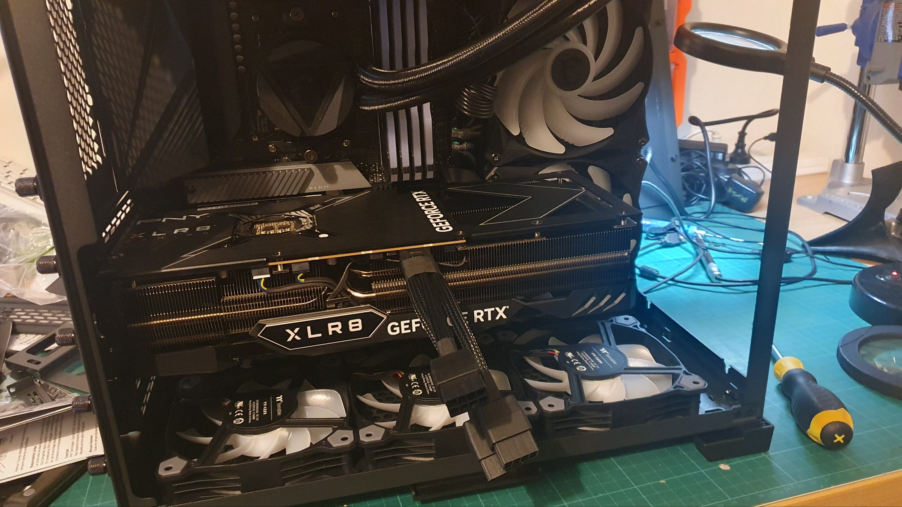

Got it powered up with all the fans whirring and the RAM glowing. Status LED stopped at VGA. DOH! The AMD Ryzen 9 5950X 16-Core AM4 3.40 GHz Unlocked CPU Processor is not an APU. So, that's why I sat there, dumbfounded, without HDMI coming out. No on board graphics and the CPU does not come with.

I had avoided putting the GPU in, so I didn't fry everything if I had done something wrong.

So, I got over myself. Installed the GPU.

Built up the case around the GPU to hold that sucker in.

Inserted the triple tailed power lead for the GPU, and ...

... no mating leads in the set that came with the Corsair SF850L 850W 80+ Gold Fully Modular PCIe 5.0 ATX 3.0 SFX-L for the PNY XLR8 16GB OC mitt GEFORCE RTX 4080.

FRAAAACK!

Back to the online shopping!

Noting, there were (in the end) 2 but not 3 PCIe 6+2 connectors in the Corsair kit. However, for the sake of feng shui I think I'll get me [3 of these suckers](https://www.mwave.com.au/product/type-4-sleeved-pcie-cable-with-pigtail-connector-and-capacitors-for-type-4-psu-ac48301).
