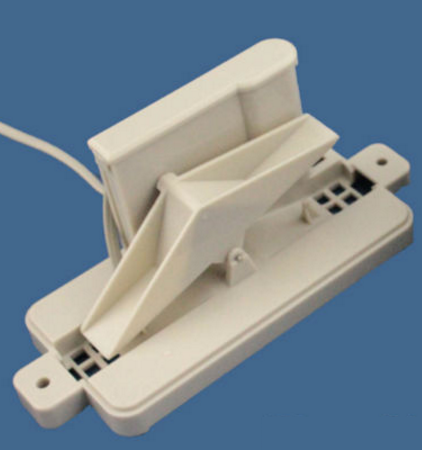
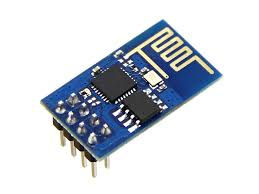

[caption id="attachment\_3144" align="aligncenter" width="422"] Rock it to me baby![/caption]
So, get this, for US$15 you can get a rain gauge that does naught but [yep, still yep and yep, then maybe nope](http://marg-project.eu/how-does-a-tipping-bucket-rain-gauge-work/).
That is, the cover has a funnel and water drips in and cycles the rocker!
 
[caption id="attachment\_3151" align="aligncenter" width="232"] Simple tich?![/caption]
 
That likely needs nothing more than one of the ESP littlins ...

... to chirp tich/toch onto a mqtt topic.
