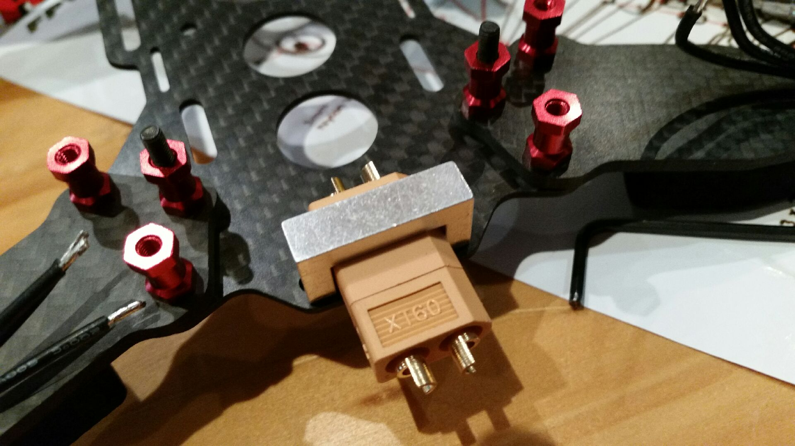
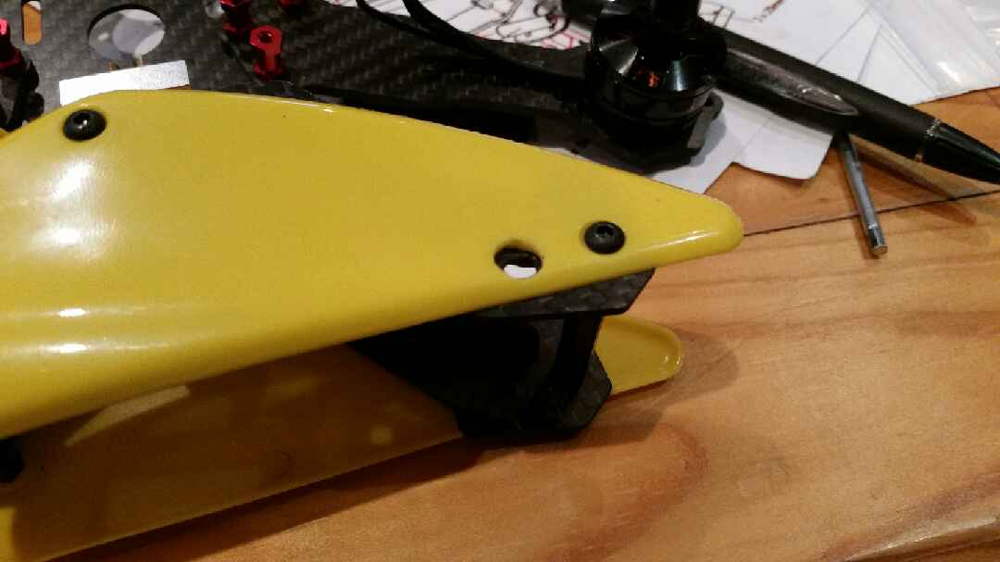

So, in the absence of any hints in the build instructions (there is really nothing post assembly diagram for frame), it occurred to me that the aluminium (aloo-min-num in American) "thingy" seemed to fit tightly over one of the two power connectors.
****
Note that, and it might just be me, but if you want to remove the side panels to get to components in the top frame, you need to bore out the hole that takes the screw that holds the top frame to the bottom frame.  Just use a drill bit rolled between your fingers.  The screw head now fits through the shell, butts nicely against the carbon fibre.  So, now two options: 1) undo the screws holding down the top frame and hinge it open, or 2) just take off the side panel.
 
 
