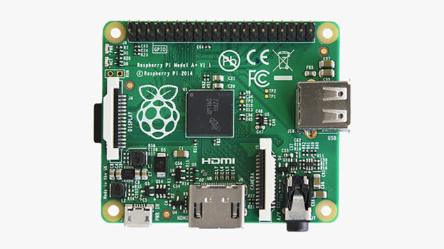

[caption id="attachment\_1682" align="aligncenter" width="636"] Raspberry Pi's Raspberry Pirate[/caption]
[caption id="attachment\_1615" align="aligncenter" width="600"] Now it all makes sense[/caption]
Of course  Hardkernel isn't to copy the Pi but Pi can copy the short form ODROID-W.  How embarrassingly transparent and shoddy and now the shining light of Creative Commons.
