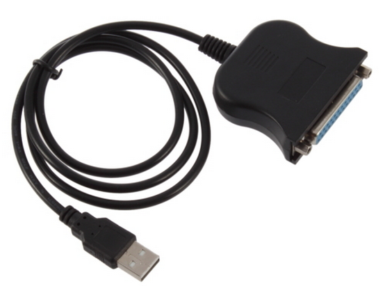

So, the most of $2 device turned up.  Promised to be a Parallel port but looks to pass as a parallel printer port.  I am not sure that the [eeprom programming software](http://organicmonkeymotion.wordpress.com/2014/07/29/how-hard-is-it-to-program-a-eeprom/ "How hard is it to program a eeprom?") recognizes it at all.  Opted to get a $9 PCI card after all so things on back burner there again.
