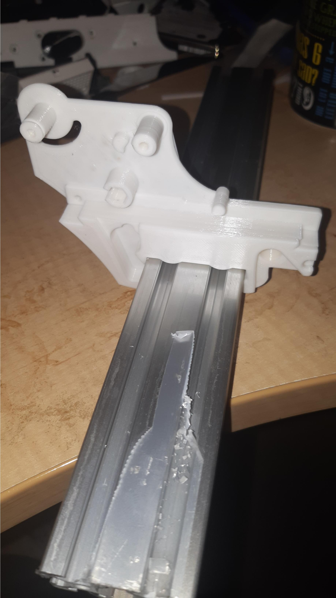
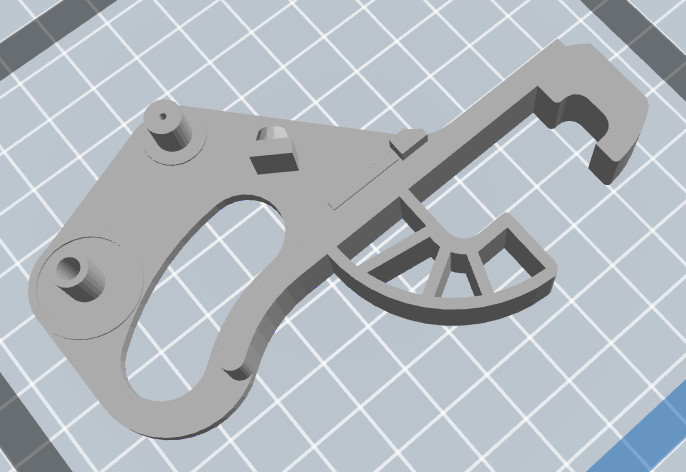

So above is the test fit of [the feeder](https://makr.zone/new-all-3d-printed-tapereel-feeder/399/), freshly off the 3D printer. Note, dropped the spool holder and opted for 4020 grasping - all tailorable using the parametrised model.  
  
Tight fit, as the extrusion is not actually OpenBuild standard and closer to t than v slot it now seems.

Still good tight fit.

But, alas, when I went to put this setup against the assembled PnP, it turned out that the 4040 leftover extrusion was short by some good percentage of a cm.

Note we do recall that the vendor struggled delivering the right order and some pieces were not all of the required length, so maybe one of the 4 pieces of 4020 x 300mm may be long enough, but I may again need go back to the drawing board (arrrrrgghh! no they weren't).

CrrRRAAAAaaaaappppp!

So I will change back to a 2020 grasping option in the one above.

In the meantime, I am also trying the following one:

Which is actually from [here](https://loonatec.com/pnp-semi-automatic-feeder/). Though the story and pictures are well behind the actual design release [here](https://bitbucket.org/Loonatec/pnp_semi-automatic_feeder/src/master/). That final design comes with a reel holder. But it's also designed in FreeCAD. It it's parameterised as is the top one, but I had to delete the reel spook holder elements out of the model, to be left with the one above. So, options. I want to trial these options before I settle on one or the other. So I'll have a gaggle of feeders to play with by the end of the week.

Noting I have printed out and like [this one](https://github.com/dining-philosopher/litefeeder) for shorter strips, and not when using reels of SMD.
