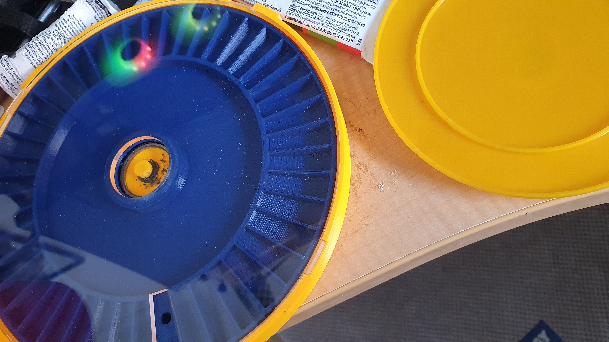

So, as a design idea kool. However, after filing down the tabs, to allow them to slot into the "catches", it turned out too fiddly with too fine a detail to succeed I think. Needs a higher precision manufacturing technique.

In fact, the clear plastic lid clips in place anyway, since the 3D printed base walls appear to be slightly too small an inner diameter for the lid. Thus, the walls need be sprung outwards to get the lid to sit in its place. So, the whole thing holds together under sprung tension. You can actually turn the thing upside down and shake it, and the lid refuses to drop out. No need even to glue or tape the lid on.

The black goop, on the centre post, is J-B Weld. I had no superglue left, and it turned out the Tarzan Grip just wanted to melt the ABS.

Nice touch in the photo, the reflection of my ARGB fans in my MonstaPC.
