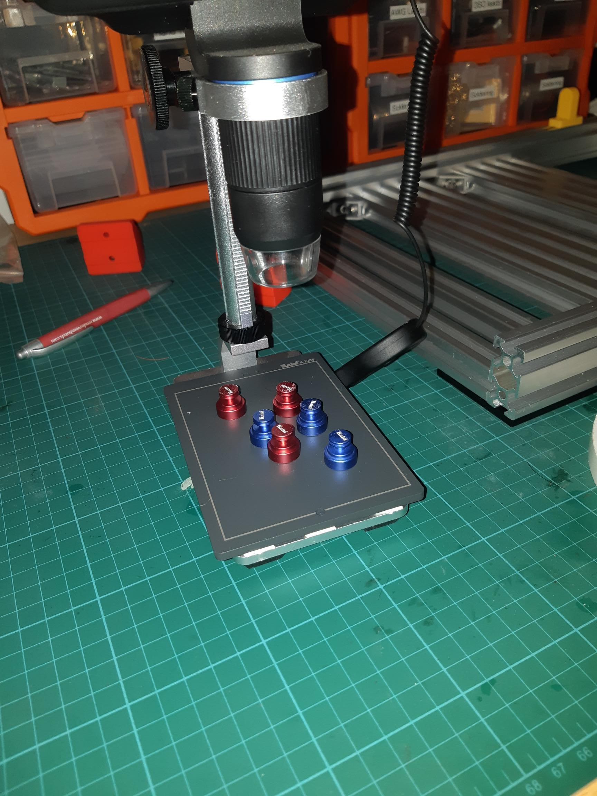
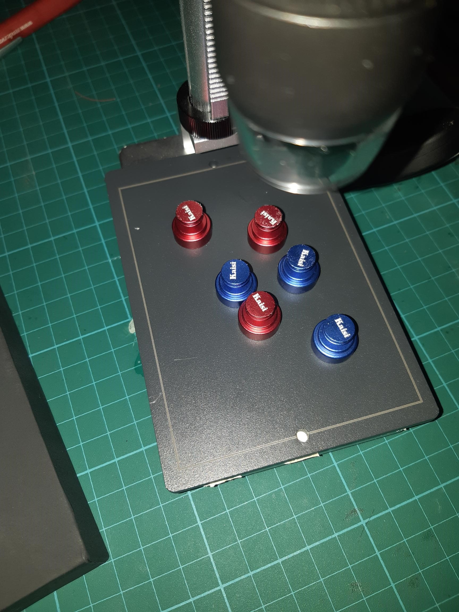
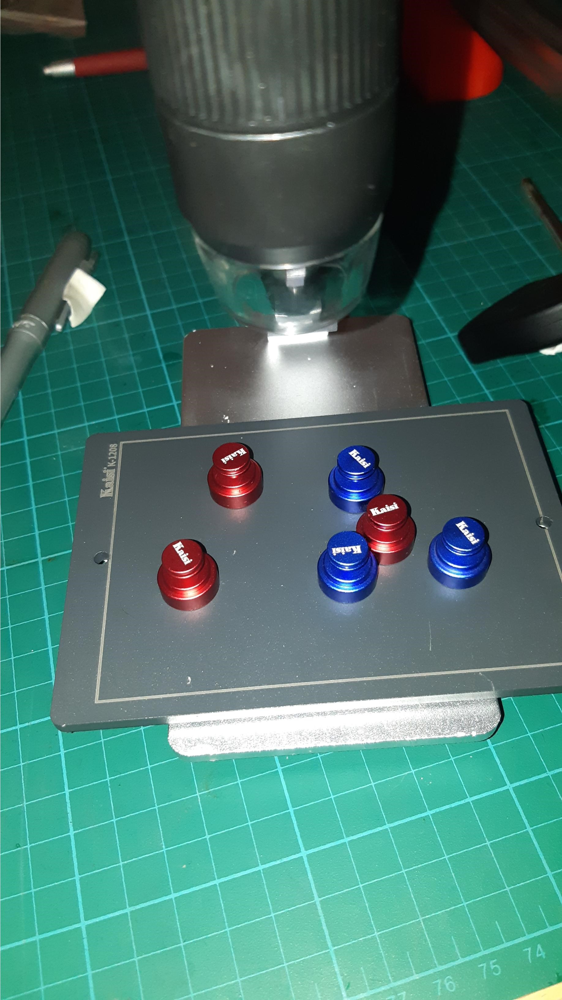

The magnetic PCB holder kit turned up and with a small amount of double sided tape voila!

Heavy magnetic plate a little wider than the microscope base.

Here is a close up of same.

I did make a backflip on the orientation in the end.
