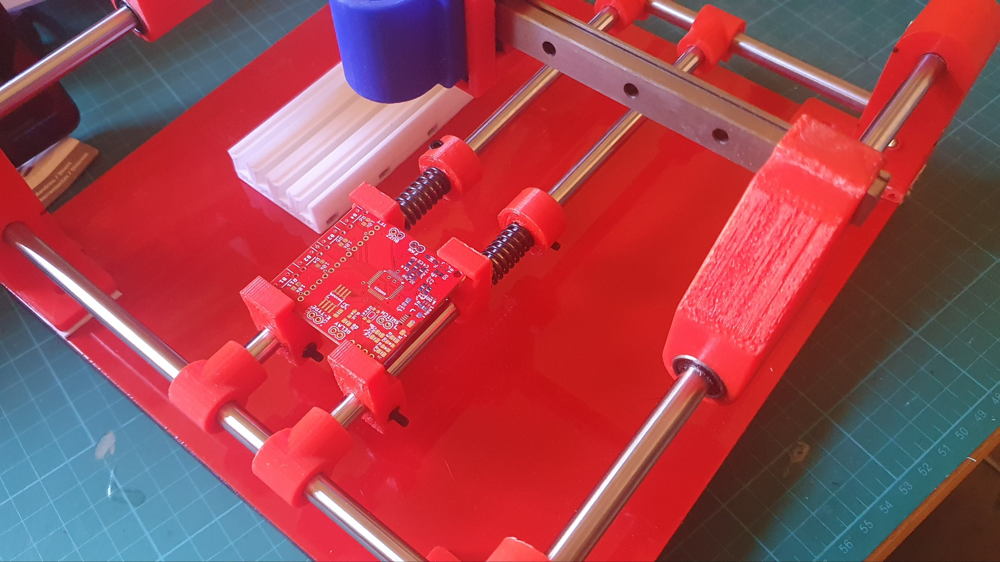
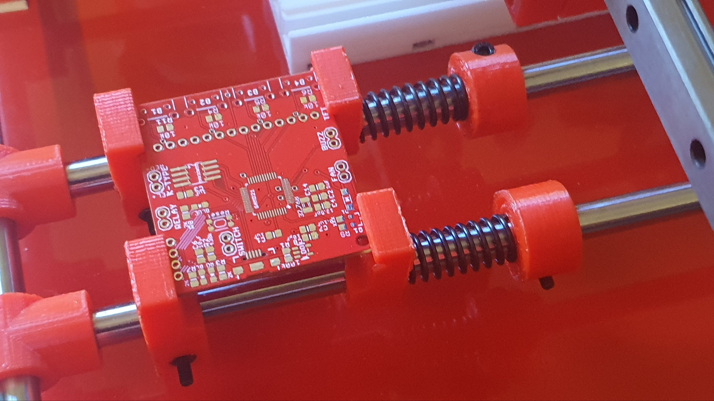
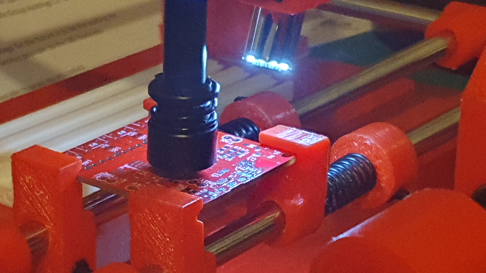
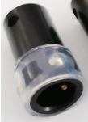

First job off the rank is a board to control a pcb oven.

Now. I short cut the assembly, by using double sided tape. That is, instead of screws or embedded magnets.

I'll pass this off as a prototype. I want to redesign the corner posts.

Firstly, to be taller, since I made them too short to use the smd nozzle holder I have one the larger manual PnP.

Secondly, I do like the idea of magnets, to hold it down on the mild steel plate. I found drilling the plastic, with a 9.5mm bit to retrofit magnets, fraught.

So, a redesign is warranted.

So, here's what you get if you don't measure twice.

So, one of these instead'll fix the problem.
