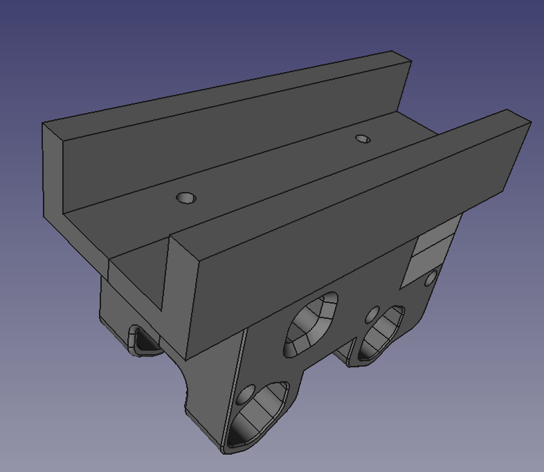
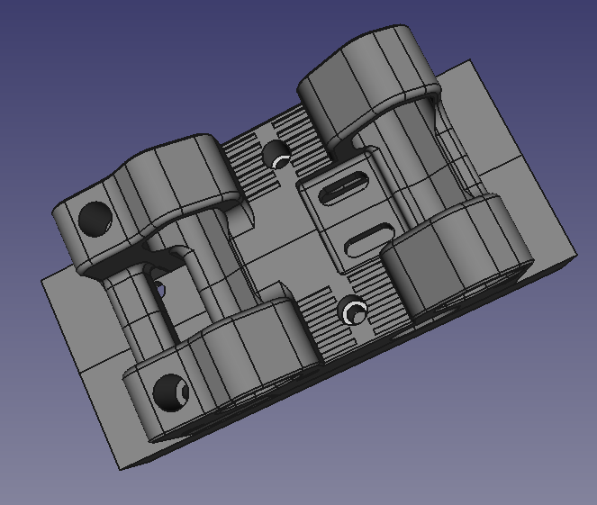
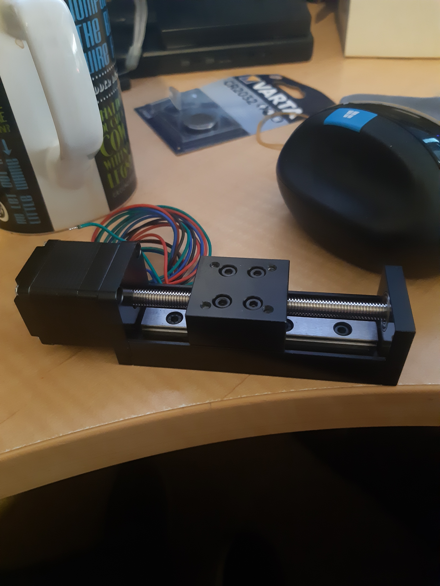
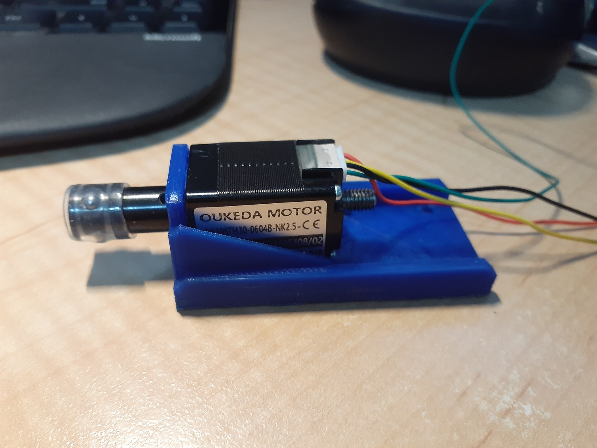
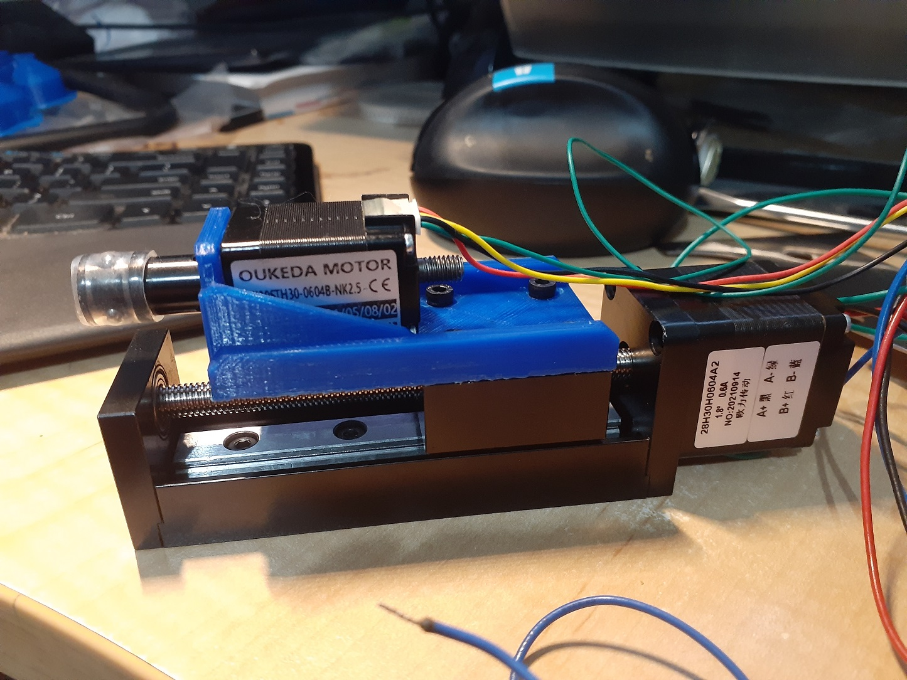

So, a little break from the problem, and the problem appears now to be solved. The z-axis for the PnP has 4 M3 holes with room for screw heads. So I opted for a slot to hold the z-axis and simply will put four M3 heat set into it (see Fig 4). Sure, throwing away the magnetic quick release option - c’est la vie.

Fig 1

On the original Voran Legacy x-carraige, there are pass through holes to tie down blocks that hold the belts. The problem was it was too fiddly to have a full pass through, so I opted to (yet again) put two M4 heat sets into the design, and will simply bolt from the same side as the tie down blocks (see Fig 2).

Fig 2

I am using FreeCAD 0.20, and the Manipulator WorkBench especially, as there are a raft of fun problems lining up things. This is really a hack, and I mean hack, of the Voron Legacy x-carriage - with a raft of binary ops to sculpt the piece towards my needs.

Not the cleanest approach, but seems to work a treat.

Never fear, it still prints as two separate parts. They are not exactly mirrors of one another, as the Voron design opts for (you guessed it) heat sets in one half to be pulled via a M4 from the other half.

Recalling, the z-axis is the one at Fig 3, zen at Fig 4, und Fig 5.

Fig 3

Fig 4

Fig 5
