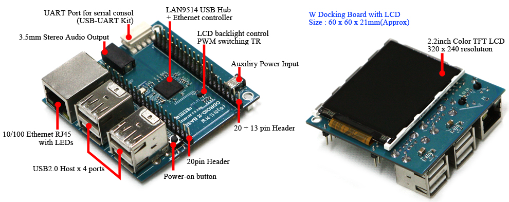

... Raspberry Pirate (ODROID-W) up.
I had to buy a micro HDMI cable as it turns out I have to recompile kernel to get the LCD going on the base or docking board for the OROID-W.
[caption id="attachment\_1554" align="alignnone" width="660"] The base board[/caption]
All good though.  I plugged the micro HDMI port into the back of my new monitor and watched the linux boot sequence run through to a config window.
So, my soldering appears to be good'n'uff.
I will sort out keyboard and mouse on weekend as a break from study and likely download an run a web framework "hello world" to push my Nephew along with his project.
