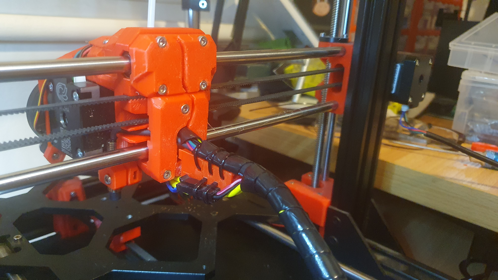
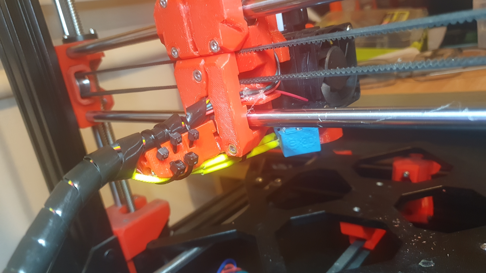
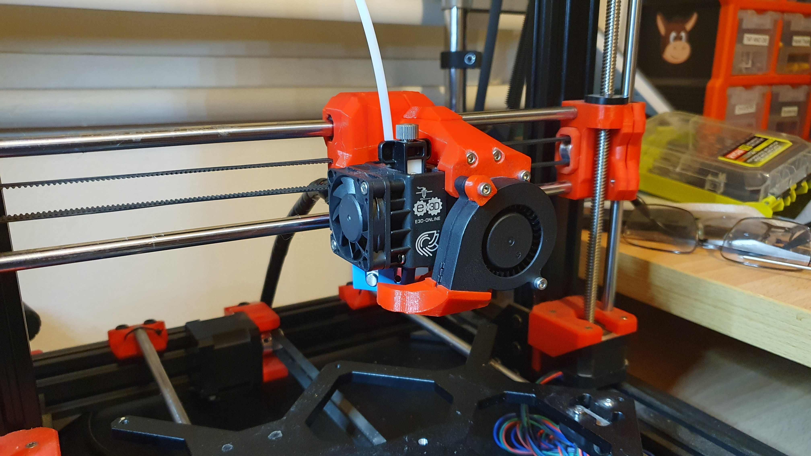

Okay, okay.

Due to the onslaught of requests, I proppa wired up the x-carriage.

Happy?

What now?

Missing wire?!

OH MY GOD!

Nope, it ain't missing at all, as I cunningly rotated the fan, to drop the exit of the power leads for that, straight to the gutter in the x-carriage (more or less).

Nope, it's not snot. It's hot glue (just in case).

What?

Yes I'll tidy that up.

Sheesh!

So yes, now the fun begins. Wiring it up and getting it moving.

Hopefully.

