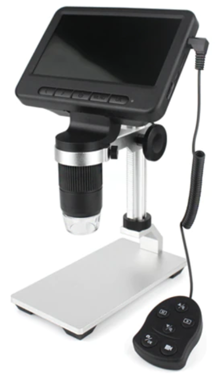
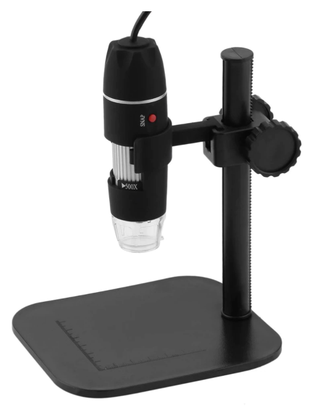
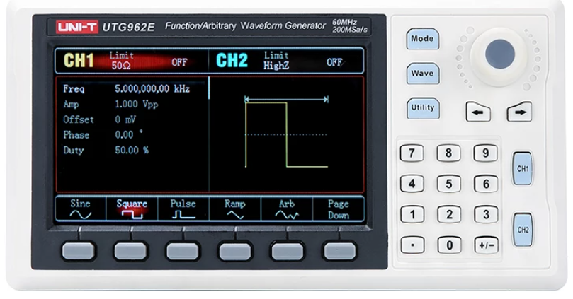

On ebay, I sold another batch of underutilised niff naff out of my drawers, so on the way now from Aliexpress, for my test/workbench, are a couple of upgrades.

First that soldering station aid for close work, the USB microscope.

Battery powered, screen, hand controls, SD card slot and USB connection PLUS Wifi! Boom!

Upgrading my old work horse.

The upgrade is required, since my eyes are not the best and with the hand soldering of smd more often now, so fiddling with the older unit and the laptop together on the test/workbench now (or will be) avoided.

But I am also expanding my test bench with a signal source in the form of a UTG962E. Sweet, given I would often use a hack on one of my FPGA training boards when a waveform was required. I did a lot of research and this unit gets great reviews as a toy for the hobbyist test/workbench.

See the [Kerry Wong](https://www.youtube.com/watch?v=ORkJGdViAhg&t=1681s) deeply technical review and the [Kiss Analog](https://www.youtube.com/watch?v=HHaIgA0QWKU) comparison review.

Gotta luv ebay!
