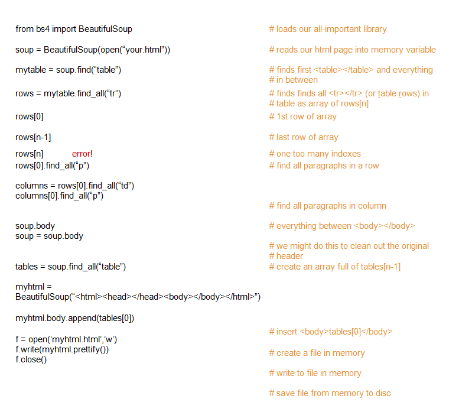

[caption id="attachment\_1675" align="aligncenter" width="400"] This is a famous photograph. More or less invention of moving pictures that we all know and love. Look at it, scroll your mouse wheel up and down quickly, just a quarter of a turn to go back in history two turns of a century.[/caption]
So, FINALLY got the call from the nephew.
Project has changed somewhat.
The original thought was a touch screen monitor based kiosk for students to pick up daily messages held in a csv file somewhere on the network.
The change was to use Android tablets (must grate as me nephew is a true blue Appleyte), and to parse data out of a html dump!
Parse data out of a html dump?
Turns out the skool system can turn out a webpage report (so I am a little dim as to why they need do much more that set up a browser looking at that webpage).  Anyway, my nephew is excited to be working with his uncle (and I needed an excuse to by four odroid-w, the wife you know).
So, his teacher pointed him at [BeautifulSoup](http://www.crummy.com/software/BeautifulSoup/) which is a python library for sucking data out of html files.
Beautiful is right.
Here is our first experiments (the whoopses excluded):

Basically if there are tables within the html the code can pick them out.  He had the idea himself of just reusing the html for the table in our file - brilliant.  So, only problem is other data is buried in nondescript 
 tags.
Will need to sleep on that.
