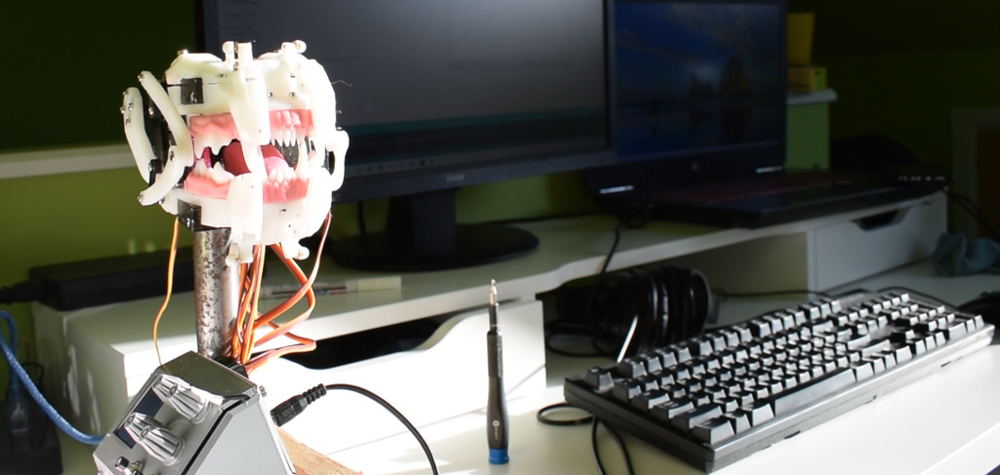
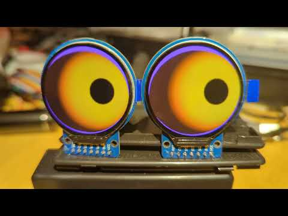
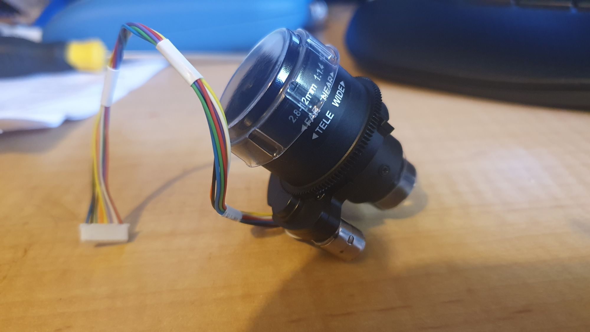
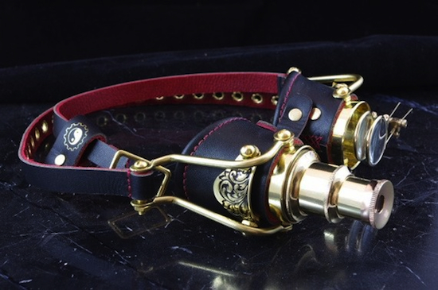

Since I've a box of 9g servos and a nutty idea.

Lllluuuuuvvv IT!

So, what about, yes, done to death Teensy or Uncanny Eyes?

But, I want a camera for face recognition. So I thought something kooky, that might opt into a steam or cyber punk feel. So I got two of these below:

So one LCD eye and a second as a camera that can zoom/focus while face tracking (though mostly for the animated effect). So, don't try to secrete the camera away, make it a feature. So, maybe a bit like this (as a rough guide, but brass plated, hmmm):

Maybe with microphone and speakers it'll be a smart speaker LOL!
