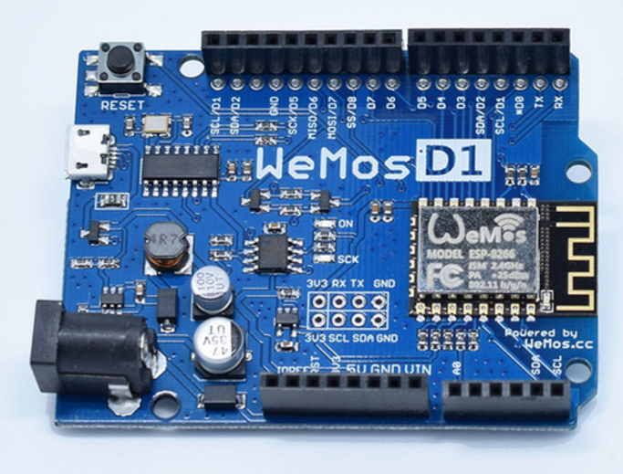
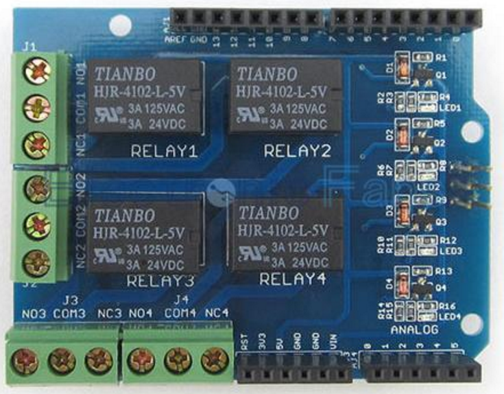

And voila!

[ESP8266 based](http://espressif.com/products/hardware/esp8266ex/overview/). Uno form factor.  $6!!
Now along with something like this for $4 ...

You can have an [OpenSprinkler](https://opensprinkler.com/) killer for $10 instead of $155!!!
Still [my old BlackWidow](https://organicmonkeymotion.wordpress.com/2016/01/03/hot-damn/) is fine for my home use but I have a backlog of family and friends wanting a wireless sprinkler controller.  Just takes a pickoff of the 12volt AC used to drive the sprinkler valves to create the voltages for the board.  A rectifier and few capacitors into a voltage regulator et cetera.
Goodbuy OpenSprinkler \*sniff\* so sad to see you go.
