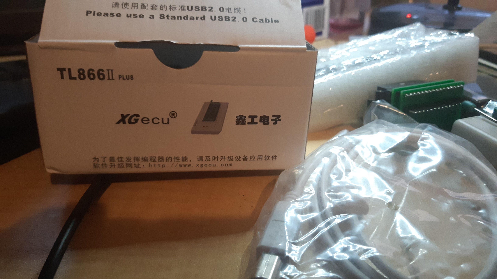
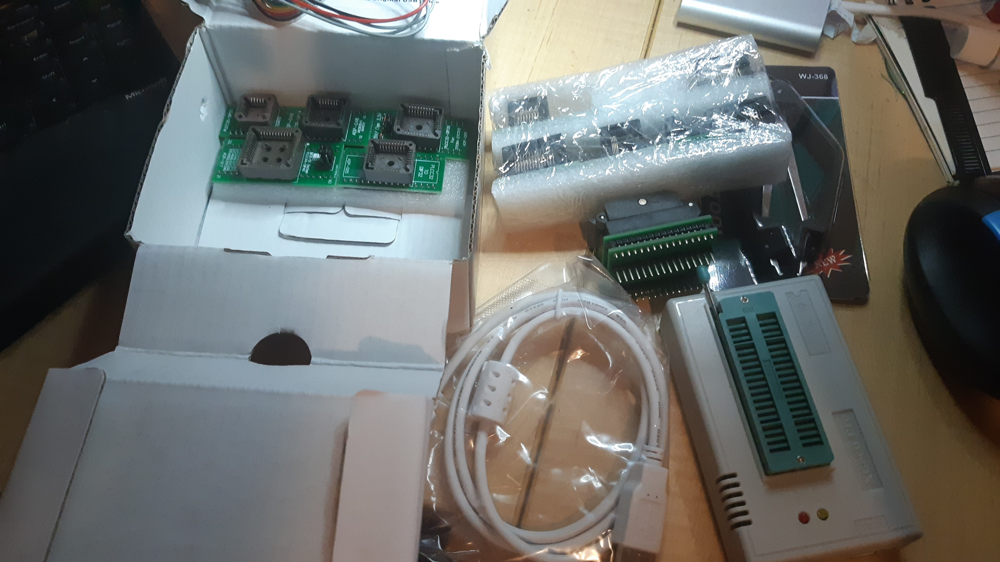
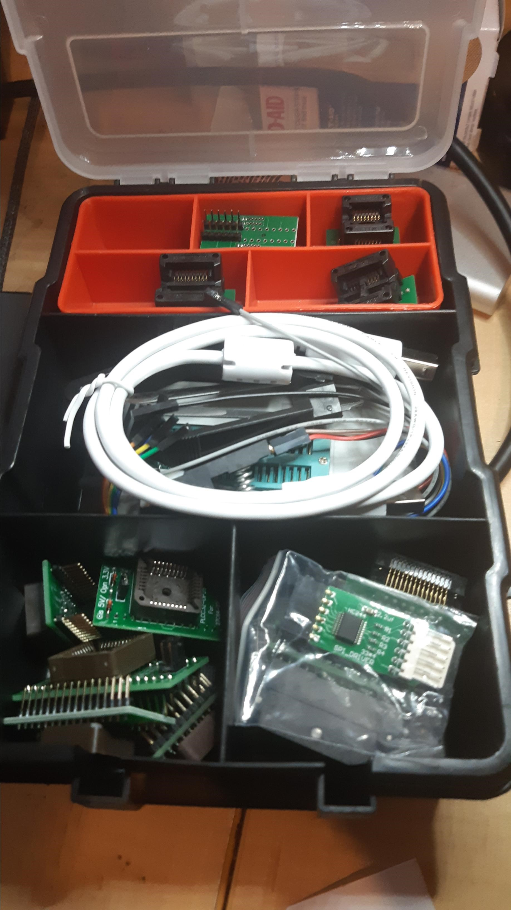

So, recalling the "guidance" on [youtube](https://www.youtube.com/watch?v=41uXzIAKEho&t=126s) to take care with who you buy an XGenu TL866II programmer from. If you buy from an official seller you don't need sweat the problem of potentially getting a clone that does not program all the chips its supposed to. If your programmer does not turn up with an XGecu box then ...

And I still have a few empty trayed boxes, so it turns out the entire kit fits snuggly into one.

Snuggly tucked into that box is:

* One TL866II Plus Programmer
* One USB cable
* One ICSP cable
* One SOIC8 SOP8 ZIF adapter, Body width 150 mil (3.9mm-4.1mm)
* One SOIC8-DIP8 ZIF adapter, Body width 200-209mil (5-6mm)
* One PLCC44 TO DIP40 adapter
* One PLCC32-DIP32 adapter
* One PLCC32-DIP28 adapter
* One PLCC28-DIP24 adapter
* One PLCC20-DIP20 adapter
* One TSSOP8 AND SOP16 adapter
* One QFP32-DIP32 adapter
* One SSOP8-DIP8 adapter, Body width 170mil
* One SOP28-DIP28 adapter, Body width 300mil
* One SOP20-DIP20 adapter, Body width 200mil
* One SOP16-DIP16 adapter, Body width 150mil
* One 8-16 SOIC adapter
* One SPI driver adapter
* One SOP8 test clip
* One PLCC IC extractor
