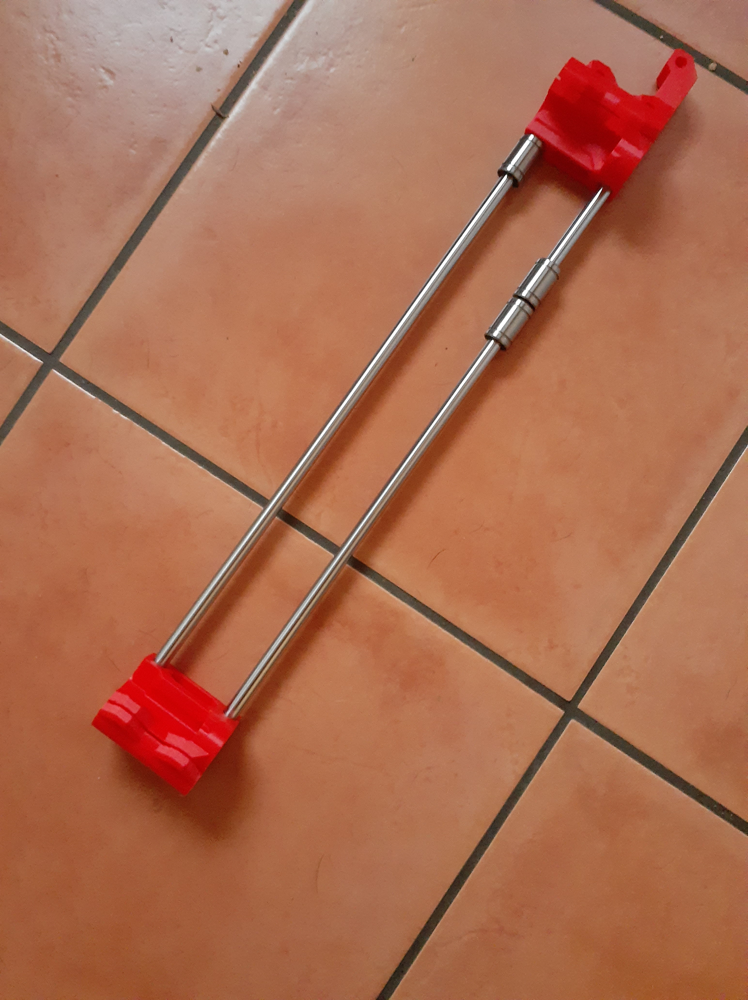
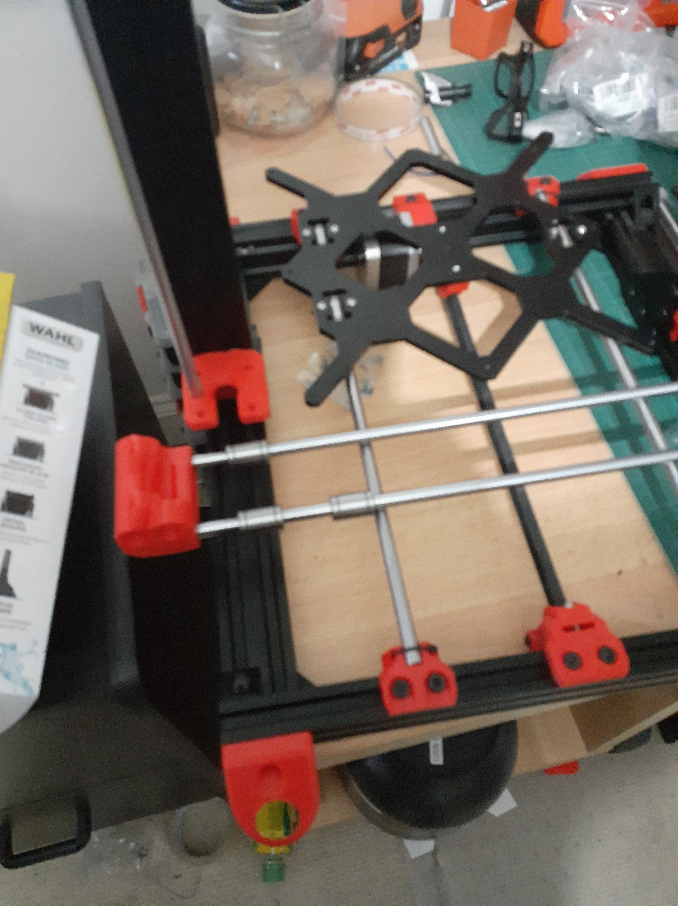

Yes, I know. Measure twice, cut once.

Got me X-carriage built. Sweet. Very tight fit. Needed light tapping on rods to get them to fit into the idler end. Couldn't budge the x-motor end until I remembered the hair drier! A few minutes gently warming the plastic and it slipped in (Oh No! Double Entedre!).

Then ... then I checked it for length. DOH!

Reprinting x-carriage bits again now.

<insert deep gutteral groan emoji here>

🙈
