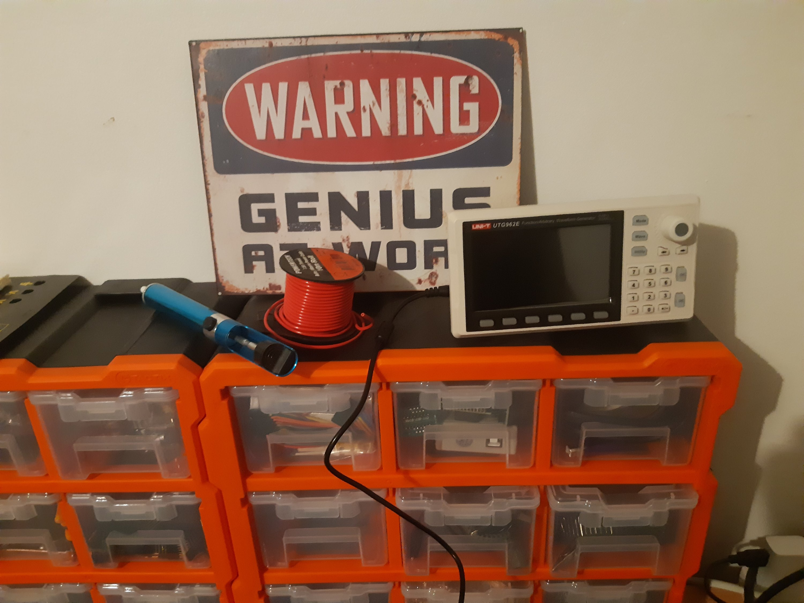

What's different about me workbench?

Scanning ... beep, beep, beep

No. The desolder pump has been around a few years replacing an older workhorse that I had for a couple to three decades.

The heavy gauge wire? Yeah. A couple of months old but not that.

What? The drawers? Yes. The second to latest.

Absolutely! The programmable signal generator turned up! You probably didn't notice it as it's tiny!!

A fiddle found a few foibles for sure that flummoxed for a moment. The fix was not intuitive but in hindsight the human factors brilliant. Curious?
