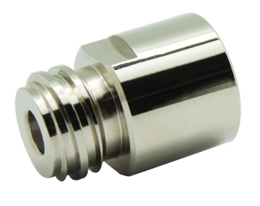
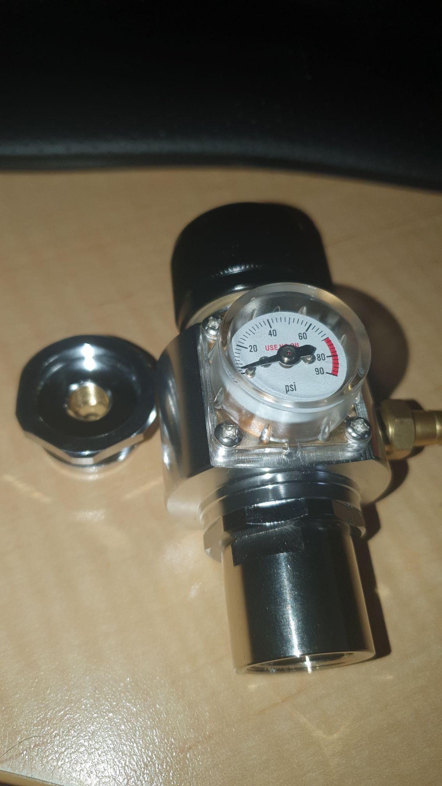

So I got the 16gm cartridge adaptor, from the [brewing widget mob in the US](https://www.williamsbrewing.com/), via [myUS](https://www.myus.com/).

As I suspected. It happily fits the regulator.

If only you could get one (loose) for AUS sodastream bottles.

Oh? I can! I finally got the search terms right, and [found an adaptor at Aliexpress](https://www.aliexpress.com/item/32901772000.html) (finally).

So, that male end should fit into the original female adaptor for the regulator, and the female end apparently should fit onto the sodastream bottle. So, a small portable option, with the 16gram fitting, and then a larger option for the home workbench. Unless these fittings dwell on their pronouns that is.

Neat!

UPDATE

It's turned up!

Now, do I bother with a 24gm cartridge adaptor? Or larger?
