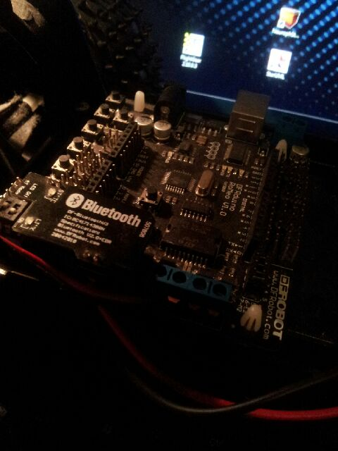
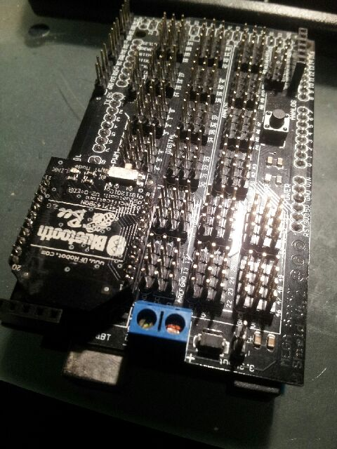

So, first thing I did was to open up one of the Verilog prototyping text I got to start training up on the xilinx tools. Half a day doodling with the tool, changing the designs, synthesizing, simulating ... most stimulating.  I got myself a copy of "[FPGA Prototyping by Verilog Examples](http://www.amazon.com/FPGA-Prototyping-Verilog-Examples-Spartan-3/dp/0470185325)" by Pong P. Chu.  So, with the latest ISE Design suite installed one can design and verify without having to even heat up the soldering board.  I've also got the Altera toolset installed so I will try running the examples in there as well to get a feel for the difference between the two tools.
Also managed a copy of the "Blue Book" - the gospel of HDL design.  And another recommended text is on the way.
Cobwebs thus slowly dusted off.
Today, I went back onto the modifying of the firmata code to work with [s4a python and bluetooth](http://organicmonkeymotion.wordpress.com/2013/09/08/it-occurred/ "It occurred …") as a prelude to integrating with POSH - then onto SPADE.
I opted to knock up two modules: 1) for the Romeo on the indoor rover

; and 2) for the MEGA1280 I use for experimenting.

I have experimented with the [SNAP modules](http://organicmonkeymotion.wordpress.com/2012/08/05/the-full-history-of-the-synapse-debarkle/ "My run-in with Synapse and SNAP") in the MEGA board and you'll note I also got a XBee format Bluetooth module to allow me to drive the board with Bluetooth commands as well.
