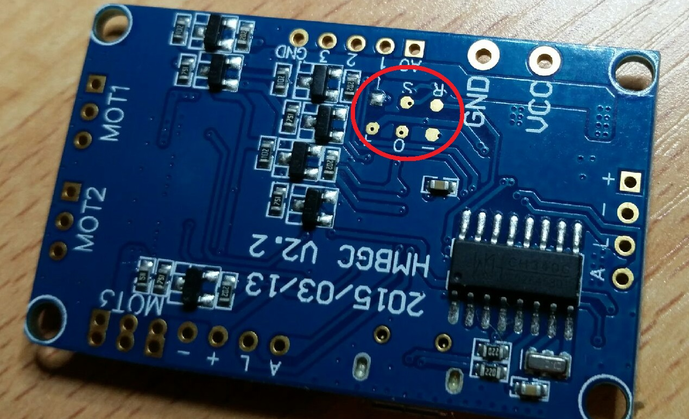
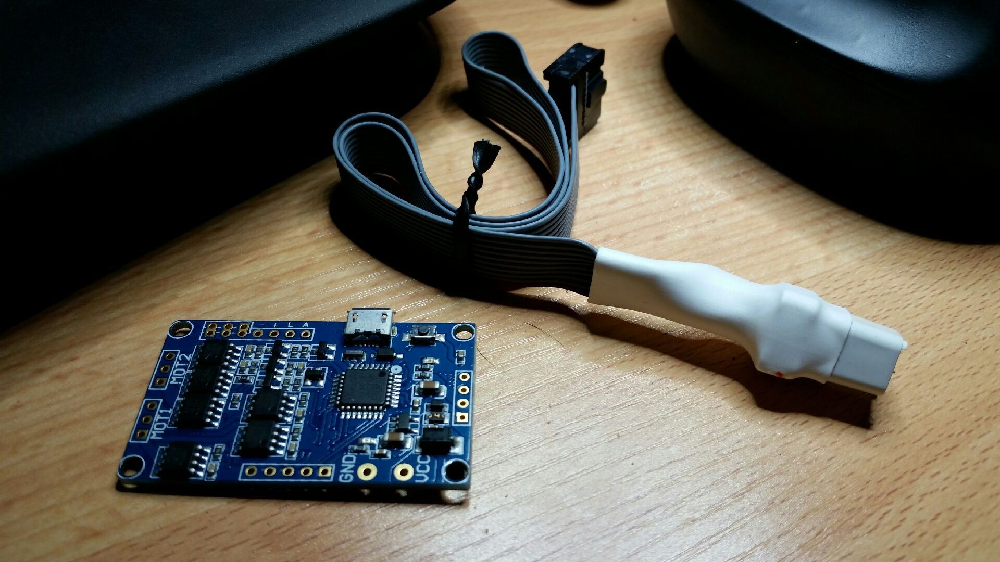
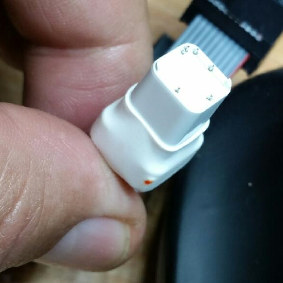
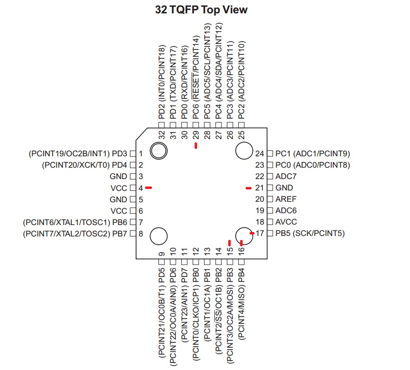

So, got my travel approved for the conference I am going to.  I am still waiting on the review comments back before I generate the final paper.
In the meantime I thought I would dust off the bits I bought for the home-made LIDAR and start fidgeting.

As I am cheating for the prototype, I will need to do something about setting up the Atmega328P based board.
To setup up the board I need burn on the Arduino bootloader, since the system has its own (or so it would seem).
To do that I need use the ISP and ...
DOH!
The pesky board has pads, with no through holes, on the bottom.
Hmmm.  Nasty fiddly work.
But wait!  I did get a gadget for bombing the small quad flight controllers I scrounged.  Et voila!

The gadget fits over the atmel chip and has pins enough to power and program the chip in situ.
Not a common gadget, came across it ... don't remember where.

Only downside it fits a 10 not 6 pin ISP USB programmer.
DOH!
I have a BAITE evUSBASP 10 pin!
All coming together.
Blowed if I can find info on the pin-outs of the header LOL.  Long lost the paperwork.
However, I do note Atmega328P programming uses pins 1, 7, 8, 17, 18 and 19 on the DIP chip.  So that's RESET, VCC, GND, MOSI, MISO and SCK.
On the 32pin quad pack it looks like 29, 4, 21, 15, 16 and 17.
So ...

Phew!
The three pins grouped in one corner sit over the corner opposite the chip key.
So now we can re-burn the sucker with the Arduino bootloader.
It would seem that the smudge of bolognese sauce in the photo coincidently marks the keyed corner too LOL.  Do they sell indalable bolognese sauce?  I might substitute with a marker.
Nuances factor, is the chip on the gimbal board 3.3V of 5V.  I have an older programmer that is 5V so I am screwed if the dang board is 3.3V.  That'll be the next hurdle.
