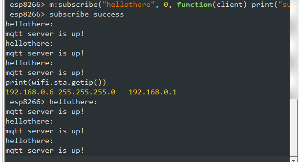

So, at last, now that the OPiZ setup saga is over (fingers crossed) we begin over.
I [built a new nodemcu firmware for the WeMOS](https://nodemcu-build.com/) to include:

* bit
* end user setup
* file
* GPIO
* MQTT
* net
* node
* RTC Time
* SNTP
* timer
* UART
* Wifi

A few coding snippets later and  the WeMOS can catch the mqtt topic running on the OPiZ feed by the node-red on the OPiZ.

So, I can now parcel up the OPiZ as the house server and tidy up the sprinkler system.
I did note that the WeMOS did not come up first time I bombed the firmware.  That was sorted (it seemed) by selection the 4MB Flash option on ESP8266Flasher.  The ESP-12E on the WeMOS has a 4MB flash and I noted that there is a branch of the nodemcu frozen in time now for the 512kB chips - so go with the master branch if you have the WeMOS D1 R2.
I did also manage to break a hoodoo now that nodemcu does away with autoconnect for the MQTT.  The timer callback scheme works a treat.  I can reboot the OPiZ and the WeMOS will reconnect once emqttd is up and running again.  Of course, I have a LWT setup so that the emqttd server will tell the node-red if the WeMOS drops off the channel.
This is getting exciting now.
