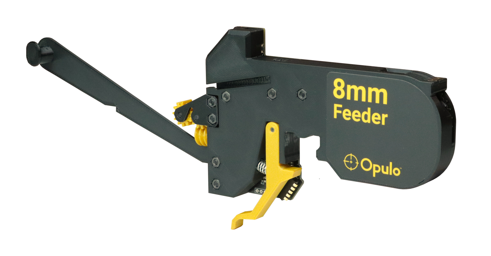
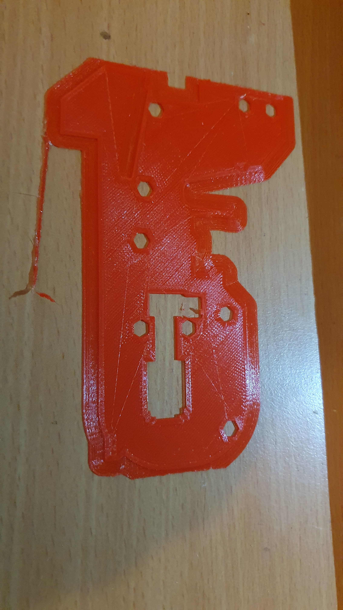

So, final sprint on [Bear Build,](https://organicmonkeymotion.wordpress.com/category/bear-build/) so I can think about the automatic PnP machine build again.

Since I was stalled for so long, the [Opulo feeders promised](https://github.com/opulo-inc/feeder), are here, though only in 8mm size (so far).

Looks like about AUD$22.00 for 10 mobo from PCBWay, no stencil. Or AUD$40.00 with stencil and cheapest mailing (Aliexpress).

So, I can opt for a drag feeder or trays first, to then do a run of the automatic feeders. So, that'll be the option to buzz out the automatic PnP setup.

It'll be fun though, as that problem with the flat ribbon cable, of me old 1st gen Finder, is still hanging on. I may need to put the new cable and board in, since the jiggling of connectors has "unjiggled".
