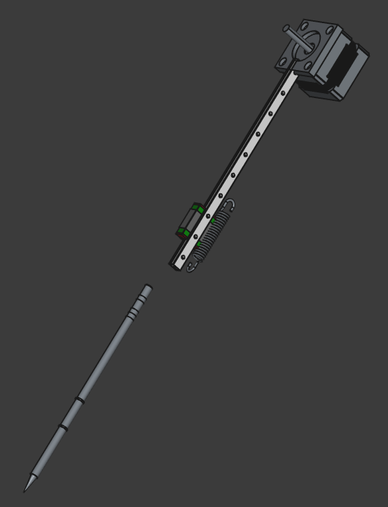
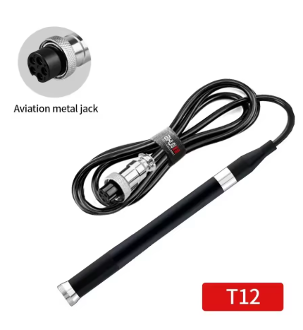
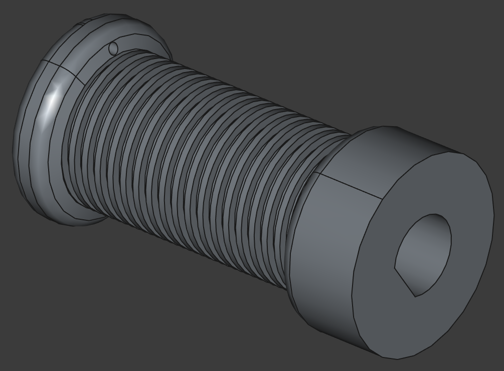

... so many fits and starts.

Travelling for work, flu twice in two months, other sad family matters.

Life's too short AND ...

I don't have enough projects banked up in my workshop.

To wit. This gave me an idea!

https://www.youtube.com/watch?v=K3eIghQjXx4

Now I think that may be a NEMA 14, which is kool, since I have one in a box (though I'll need to get one with more torque).

Poking round on the Net for CAD models and I get to something like this (as a starting proposition).

I took a punt at 150mm of MGN07.

I've already ordered a T12 which seems apt since the hot ends are quick fit. There was models of the elements but not handles, and not all T12 on Aliexpress have such slim handles (that make more sense if clamping).

What?

Oh yeah.

I hacked up a capstan.

Huge right! Nah, 6.5mm radius at the ends and 5mm in the middle. An exercise in assembly using Part Design, sketches and Body thingies. Its only an experiment and it grew organically as I fiddle with things. Of not the "D" shaped Pocket for press fitting over the stepper shaft. And the hole in the other end for tying off the 25lb fishing line (which is supposed to come in 0.5mm diameter).

I know fishing line has "stretch" but look at the application. Who knows, I'll need play with that. The real issue is having enough track on the capstan to collect enough linear movement to make sense for the application. That cross pollenates with the motor torque et cetera, et cetera.

I'll mount at least one hall effect sensor on the rail to gauge max "pull" travel.

I'll have to play with spring tensions et cetera.

The robot will be based on a RatRig V-Minion and I've already printed the related parts and ordered the 3060 et cetera.

Why bother with the complex hotend if you've got a Z-Axis? It should be more forgiving. In a pinch we could fall back on simply holding the iron.
