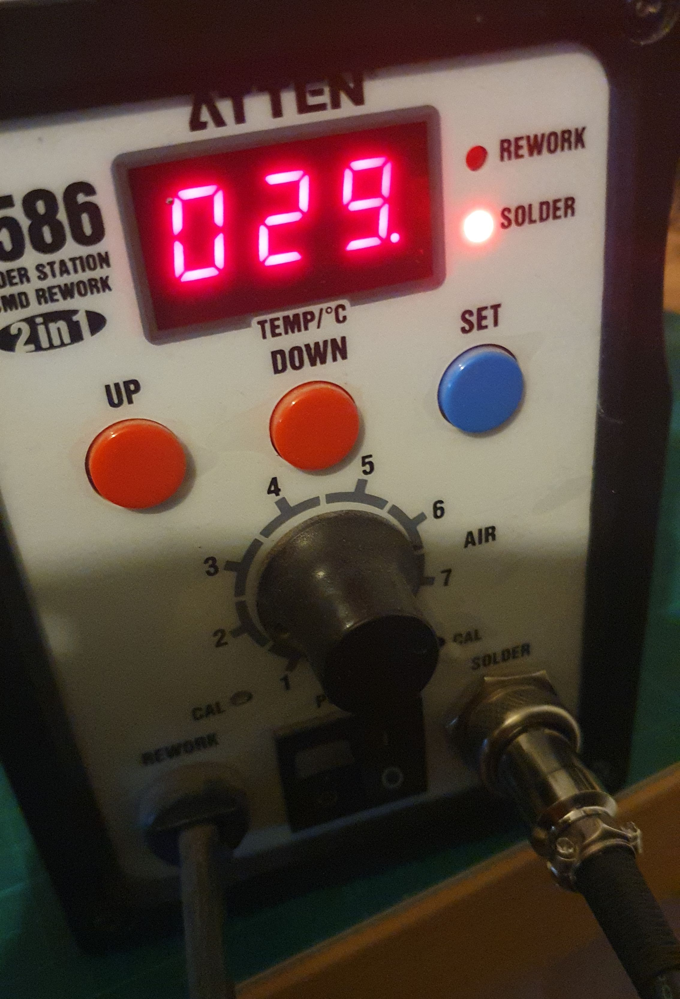
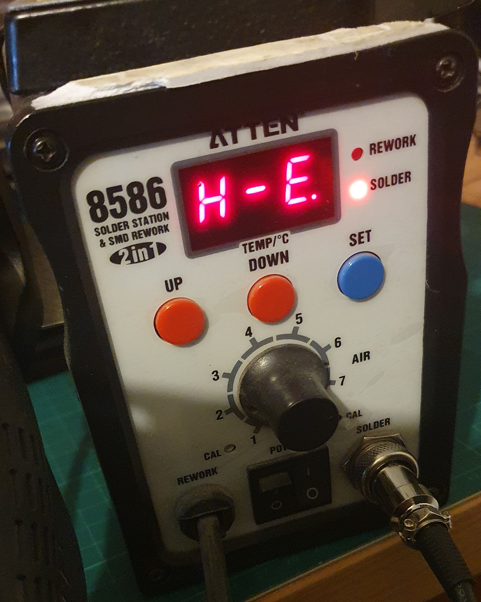
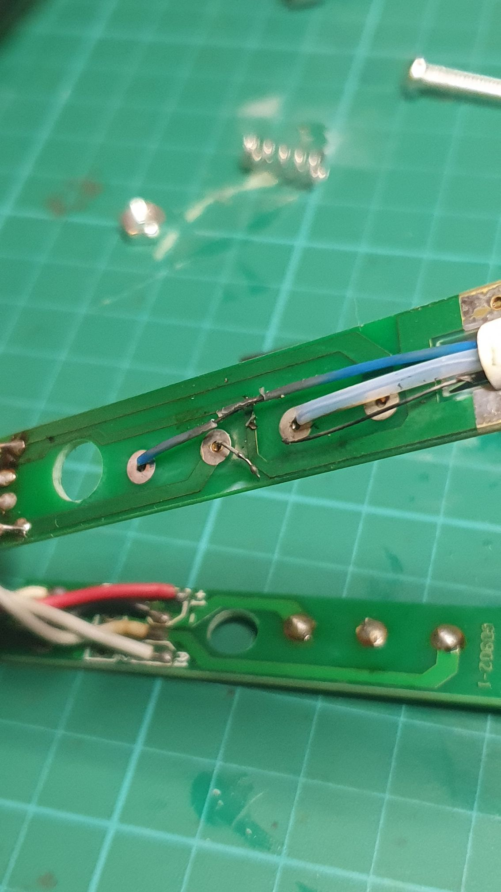

I haven't done one of these rants for a while.

Got me a pair of [920 soldering "tweesers" from Aliexpress](https://www.aliexpress.com/item/1005006667913189.html).

Got me a great room temp thermometer for a couple of minutes (Figure 1). Then gots me a "H-E" error, which from the manual means, H for heating E for element is fragged (Figure 2)!

Figure 1

Figure 2

Straight outta the box'n'all.

Congradulations Grodak Instruments, on your Potty Award!

So, I guess I now get to find out how the innards of a pair of soldering tweesers works (maybe).

Although, the first few seconds I had turned it on, I did get a little burn from the plastic, which encouraged me to turn it off. In fact, I thought I could smell electrons (see Figure 3).

