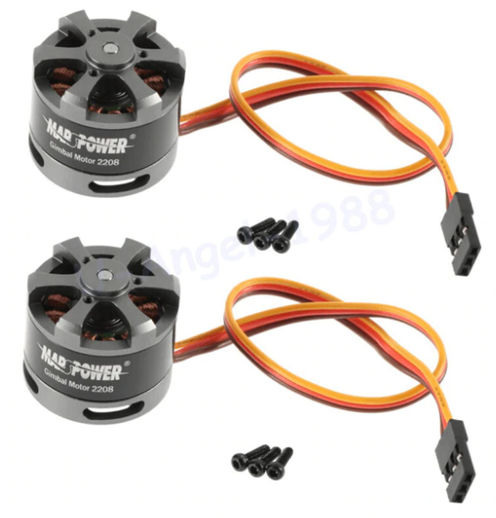
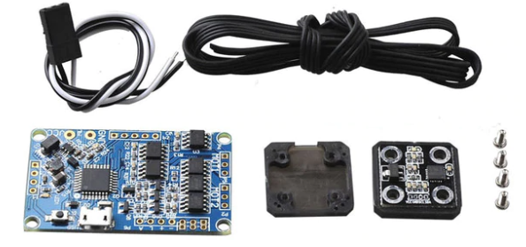
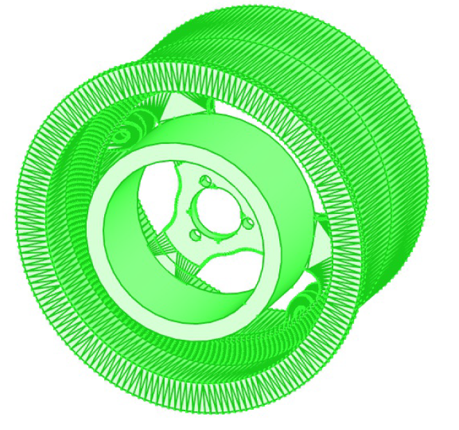
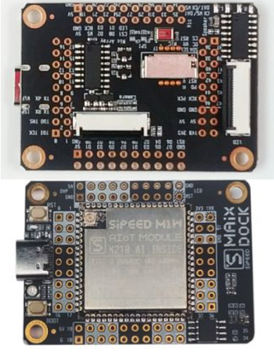

So, I have printed the carcass of a [3d printed balancing robot](https://www.instructables.com/id/Brushless-Gimbal-Balancing-Robot/).

I bought two gimbal motors.

I have my pesky gimbal controller from [my lidar experiments](https://organicmonkeymotion.wordpress.com/category/home-made-lidar/).

Go figure, you can buy rock crawler tires for my old Venom Creeper for $5 a pair, so I opted for an indoor/outdoor self balancing robot. To fit the crawler tires I grabbed a [3D model of a beaded 2.2" rim](https://www.thingiverse.com/thing:1980938). I then modified it with freeCAD to fit over the gimbal motor - including a collar to fit around the outboard spindle.

I will mate the gimbal controller with a Sipeed Dock M1W to give the balancing robot autonomous smarts. Especially with the wifi link, it can still lean on more smarts off-board.

