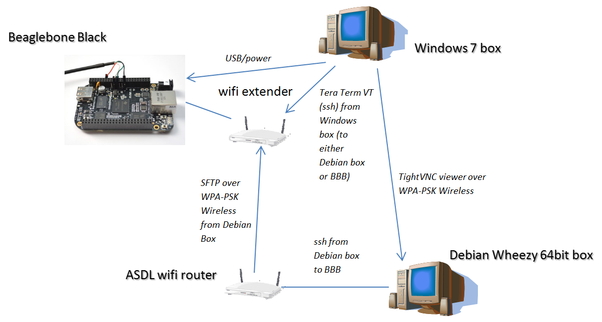

Above is my setup for the Beaglebone Black development.  What fun!
None of the example setups for using the USB alone seemed to work (the ttyUSB\* device never turns up on the Debian box).  There are a wealth of people (given the "bleats" on the various user groups) with the same problem.  So, while running it all through the USB seems a neat solution, I recommend going through the Ethernet.  Now I don't necessarily recommend you go overboard such as the way I have, but I had an afternoon of huffing putting together Ikea furniture and I wanted something therapeutic to do - so there.
I didn't want to dual boot my Windows desktop especially as  I wanted to potentially run different processes at the same time across the network so the Debian Wheezy 64 bit (the 3GHz HP desktop) went into the entertainment cabinet downstairs.
I VNC into the Debian box and did, for a time, have the BBB on a USB port of the Debian box but that meant going up and down stairs to hit reset buttons or read signals.  To fix this I got a wifi extender with four ports so I sftp to the BBB over wifi from the Debian box but power the BBB and also talk to it by the USB on my Windows box.  This means I can Tera Term VT into the BBB (as well as the Debian box) from Windows.  I can also SSH to the BBB from the Debian box (via TightVNC of the Debian by the Windows box).  The BBB also comes up on the Debian box via sftp.
Though there seems ample ways of getting to the BBB with this setup there is also the serial connection and I will soon sort that out as well.
With the four ports on the wifi extender I can now set up my Beablboard XM as well (as a desk top) and also start the vision experiments with the Android webcams I bought, remember the?:

