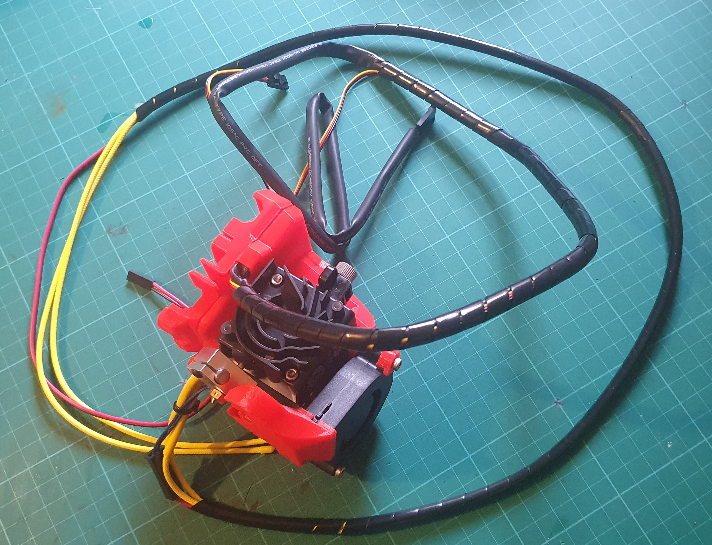
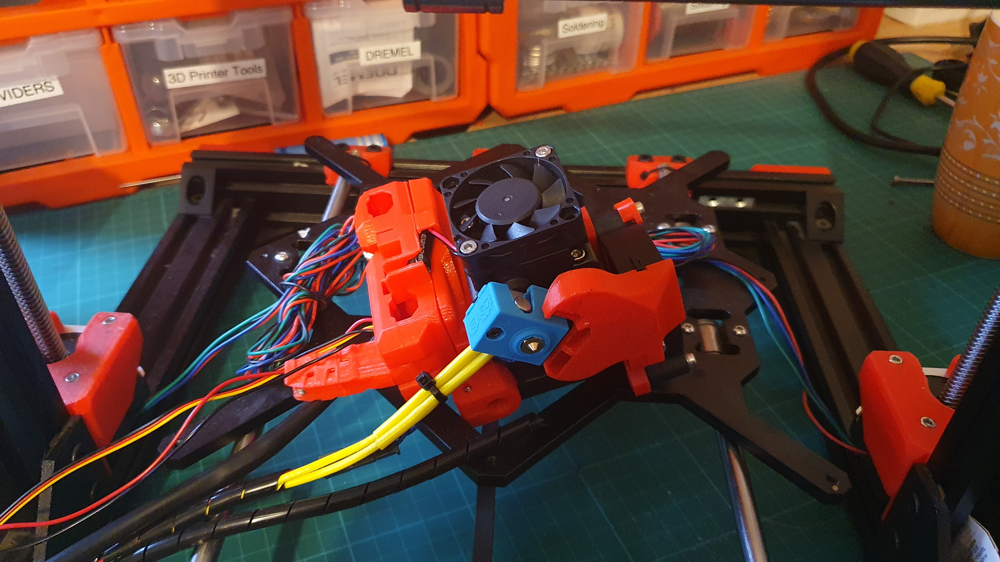
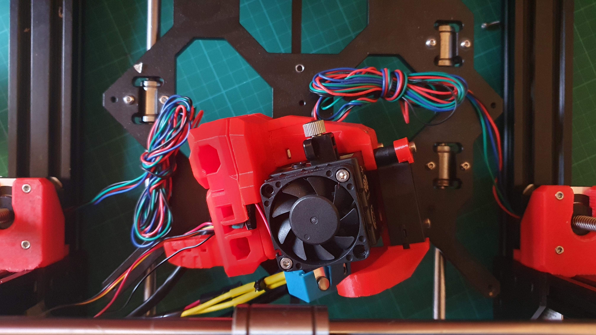
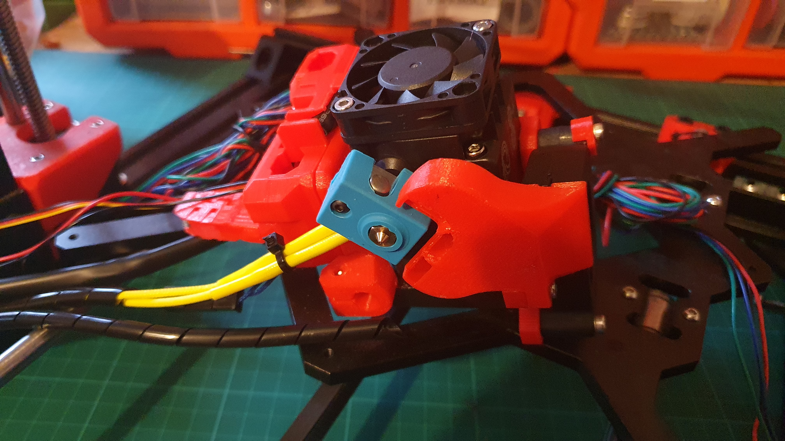
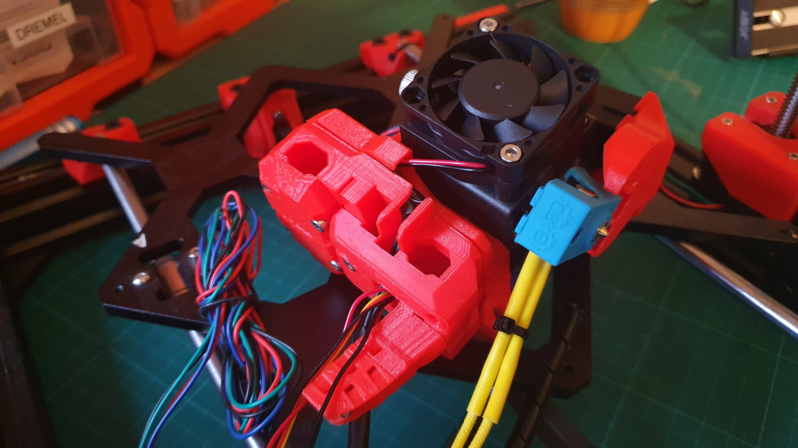

Ta Da!

So, PINDA sensor is on order. I have forgotten to attach the additional fan, so that'll happen in the background.

So, the heat sink on the extruder (see photo above) was not threaded?! Therefore, as I had an M3 tap handy, I carefully, AND I MEAN CAREFULLY, tapped that sucker.

I carefully, AND I MEAN CAREFULLY, cut some covering of the lead for the extruder (see photo above). I did this because the extruder had an oversized sheath on its stepper cable, that made it very difficult to thread the sheathed leads through the body of the X-Carriage. That'll all get re-wrapped in "spiral cable tidy wrap".

The silicon heat shield (see blue rubbery thang in photo above) actually complements the colour scheme, by not trying to.

I ended up partially disassembling and then re-routing the wiring from the fan (see photo above).

Below, the stop action for the second half of assembly was marred because it was well and truly out of focus. Still not sure what the problem was, but as my eyes are crap, I would say 50/50 it's me. So, to address the issue, rather than disassembling the X-Carriage, and reshooting, I had a bit of fun with it. I sucked the second scene into OBS, and added a VCR style effect over it. To cut to that second scene, I thought it would be fun to have the "projector" break down, and have some noises while fixing it, in the dark, to then account for the change.

https://www.youtube.com/watch?v=n-TmFX40hAk

It turned out a hoot, IMHO.

