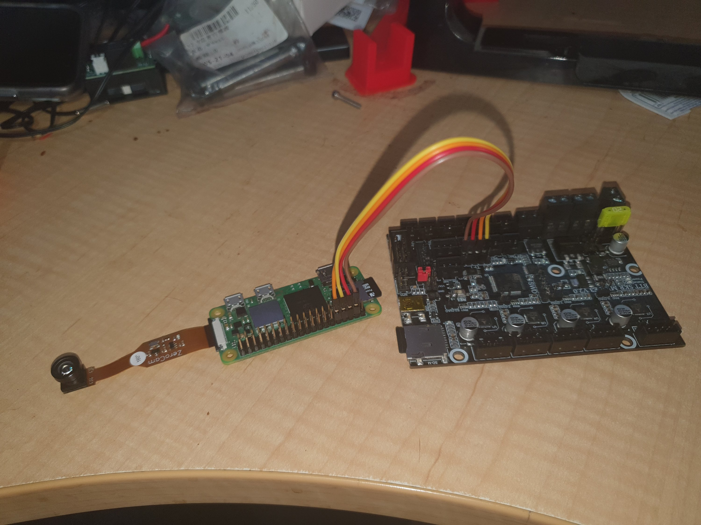
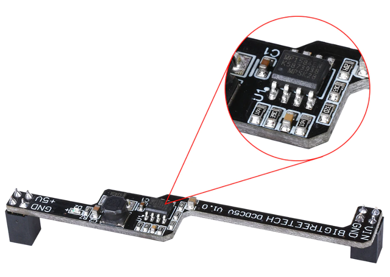

So far so good

Still waiting on my power supply. But I've burnt Klipper firmware for the BTT SKR MINI E3 2.0, and OctoPrint running on the Raspingdoodleberry Pi 2W.

But wouldn't you know it. At least one report of [fragging of BTT SKR MINI E3 V2.0](https://github.com/bigtreetech/BIGTREETECH-SKR-mini-E3/issues/665) with this setup.

So poking around I find you can draw up to [600mA with the RPi Zero 2W](https://www.tomshardware.com/reviews/raspberry-pi-zero-2-w-review).

So what current can the "serial" port of the BTT SKR MINI E3 V2.0 deliver?

Who knows.

But, the solution might be an [additonal power adapter for LED strips](https://www.aliexpress.com/item/4000474224890.html) (apparently). Looks like you add that and switch a jumper "Neo-PWR1", so as to drive the "PWR" line with the "NPWR" output of the additional power module, rather than the on board "+5V" line. That's the loan red jumper in the photo by the way. Pins are conveniently labelled on the underside of the board.

Maybe. Can't confirm the current this might draw, but it would otherwise not frag the internal +5V circuit of the BTT SKR MINI E3 V2.0, since it runs entirely via the daughter board.

The daughterboard seems to replicate the on board power supply, same chip - being MK1584EN.

Disposable daughterboards, bought 2 - just in case.

**UPDATE**

LOL, turns out the person who reported the fragged BTT SKR MINI E3 V2.0 may have shorted it out, rather than it being a overloading due to the RPi Zero 2 W piggyback on the "PWR" line.
