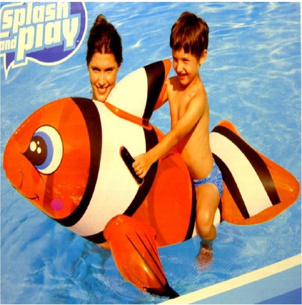
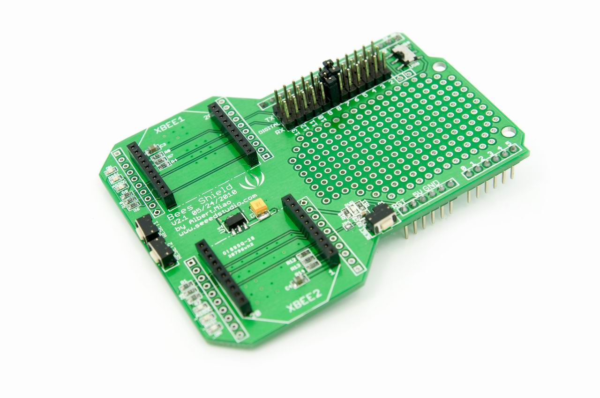
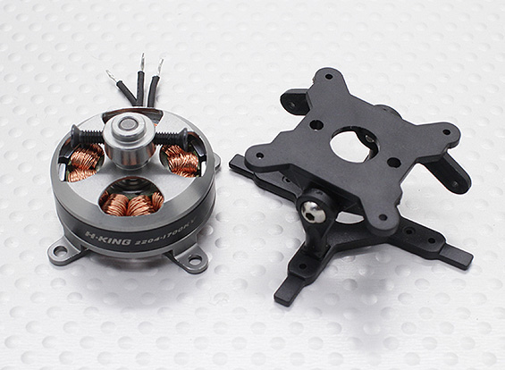
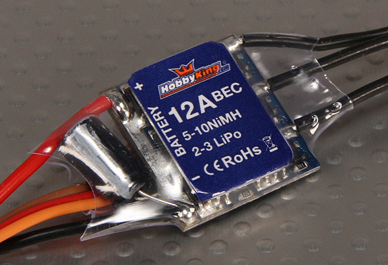

So, one project that has always been on the back burner is a submersible.  Now the reason is simple, electricity and water don't mix.  Still, as discussed in [News Splash](http://organicmonkeymotion.wordpress.com/2013/03/19/news-splash/ "NEWS SPLASH!") , that is on its way.
However, in the meantime the closest thing to having to deal with movement in a fluid is a blimp.  Various ideas for RC blimps are around but I wanted a cheap vehicle to get into it (and to have something to give my nephew to get him into electronics and robotics).  Blimps are actually quite expensive to buy so I thought on it and one day, down by the beach at a $2-shop I saw and bought a pool toy.  I figured I needn't be serious about it, but also the molded-in handles actually gave me a good place to hang any gondola that would be slung under it.

Of course, the flight control will be via an AIO.  I can then stage development, first RC than semi-moving-onto-full autonomous.

Now you can buy a daughter board for the AIO to carry your XBee and GPS but I opted for a dual XBee shield.  I will remove the pins used for mating to Arduino boards.  The prototyping area will be handy and the two XBee sites will be used, not by XBee RF module of  course but a Synapse SNAP module and a XBee as Bluetooth module.

The Bluetooth will be to talk to the on-board Android phone that will eventually hold the Autonomy.  Initially it can provide the camera and the GPS.  The phone can also act as the Bluetooth hub for indoor work or talking directly to my computer or tablet by wireless.

To push the blimp through the air I have ordered vector thrust units.  I will have two up front to gimbaled the vertical axis for aileron/elevator mixing and a single pusher at the rear, gimbaled in the horizontal to give "rudder".  That is, that will be the initial configuration.  The power train configuration, especially its location etc. will need to be the focus of some experimentation.

I got cheap ESC to start, they will only do for outdoor or restricted indoor work.  I'll need reversible ESC to allow the blimp to back out of trouble when maneuvering indoor (eventually).
... more to come as project comes together.
