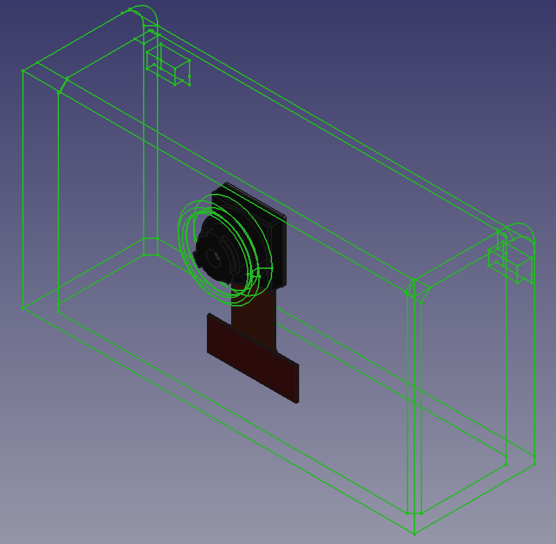

So, the point of all the bloggie 360o lenses is in Figure 1.

Figure 1

Here is a hollow 3D camera hood based upon the MHS-FS2 carcase. It has an ov2640 in the back. The lens from the MHS-FS2 clips over the top. A little software hack converts the image into a flat panoramic and then you can add other image processing over the top.
