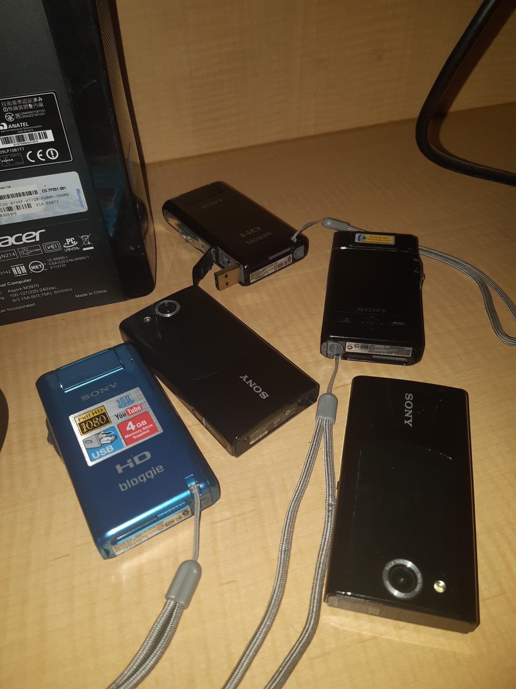
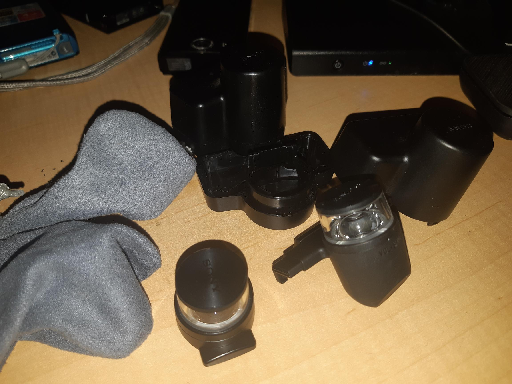

So I have a collection of Bloggies, Figure 1, one is not in the shot as I am trying to recharge them before sale.

Figure 1

I say recharge, two failed to charge! Though that is fine, since I can recommend [BetterBat](https://www.betterbatt.com.au/s/camcorder-battery/sony/bloggie-mhs-cm5/bbcb-68/) for batteries for old warn out tech. I am sorting them out to sell them off, so I'll have to either buy new batteries OR sell them after testing them. I have one that charged, and I'll likely keep, BUT I may still opt into buying that a new battery anyway. I can use that battery to test the others that didn't charge, etc.

Why did I buy so many (all off ebay so not full price, just so you know). I did so because the price I was paying for them was well less than 360o lenses off the shelf, Figure 2.

Figure 2
